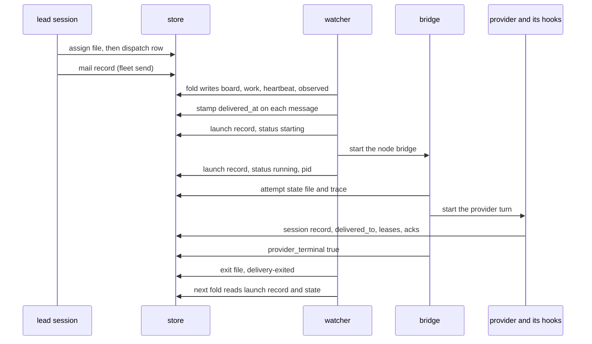

# Fleet 101

A teaching guide to Fleet and its formal models, for someone who wants to learn the whole
thing from one document. Read it top to bottom. By the end you should know what Fleet is
for, which process writes which file, how a lease decides, how the watcher starts a
provider turn and what it writes along the way, what the Quint models prove and what they
do not, and where the repository's own docs disagree with its code.

Three status markers appear throughout:

- `verified`: confirmed against the code at commit `ea76b62` (the `main` this guide was
  written from, #328) on 2026-09-12 UTC. Line numbers are for that commit, except in
  `cmd/fleet/README.md`, which this change edits and whose citations match the edited file.
- `live`: confirmed against GitHub state (issue or pull request status) on 2026-09-12. This
  can change without a commit.
- `intent`: designed and written down, not yet code.

Every claim cites the file that backs it, as `path:line` from the repository root. Open the
file; the citation is the fastest way to learn the part it names. The last section is a
drift log: the places this guide found where the existing Fleet docs and the code disagree.

This guide adds nothing to Fleet. Where it finds a defect, it records it (section 11)
rather than fixing it.

---

## Orientation: the whole thing in one screen

Read this for the shape; read the sections for the evidence. An agent pointed at this file
can stop here and come back to sections 5 (leases) and 8 (the watcher) for detail.

- **What Fleet is.** One Go binary, `cmd/fleet`, that tells the operator which agent
  session is working on what, what is stuck and what is done, without any agent reporting
  it. It has four entry points over one directory of JSON files: a harness hook, a CLI,
  an MCP server, and a watcher (`cmd/fleet/main.go:41-78`).
- **Five rules.** Location is identity (a directory's line in `roles.map` decides a
  session's role). Facts come from hooks, never from an agent. One holder per key (a branch
  or a machine resource). The substrate knows no domain word. Done is evidence (a receipt
  at an exact commit). Section 2.
- **The store.** `~/.fleet` (or `$FLEET_STATE`): every record is a JSON file published by
  write-then-rename, or an append-only JSONL. No server. The role bindings live separately,
  in `$ORG_STATE/roles.map`. Section 3 names the process that writes each file.
- **The hook** runs once per harness event as its own short process, decides allow or deny
  from the store, and writes the session record. It is registered for six events, and for
  tool events only on write-capable tools: Read, Grep and Glob never reach it
  (`cmd/fleet/internal/verbs/role.go:167`). Section 4.
- **Leases.** `CheckLease` reads, decides and writes a lease inside a kernel file lock.
  A dead holder's branch is taken over on the next write; a dead holder's resource is not.
  On that path a record that cannot be read is never treated as death
  (`cmd/fleet/internal/fleet/policy.go:379-448`). Seat occupancy and delivery's presence
  check are exceptions (section 5).
  Section 5.
- **The watcher** (`fleet watch`) folds the store into a board every tick, mails
  lateness, and starts one Claude or Codex turn per directory when there is mail, a new
  assignment or a recurring tick to carry. The turn runs through an embedded Node bridge.
  Mail is stamped `delivered_at` before the start: the stamp is the reservation. Section 8
  walks one delivery end to end, naming each durable Fleet write and the process that makes it.
- **The models.** `cmd/fleet/model` holds Quint models of the lease decision and of a
  session dying while its child keeps writing. TLC checks every reachable state of the
  lease model; Apalache finds four counterexamples that are compared byte for byte with
  frozen traces; one of those traces is replayed against real Go and a real process tree.
  `./judge.sh` passed at `ea76b62` on 2026-09-12. Section 9.
- **Honest status.** The launch/reservation protocol from #318 and #326 has no model
  (section 10). One open gap is known and deliberately left unfixed: if the watcher dies
  between writing a launch record as `starting` and rewriting it as `running`, that
  directory never launches again until a person removes or edits the record; no Fleet verb
  clears it. A second was found while writing this guide: a one-shot `fleet watch --once`
  can exit before the bridge has received its request. That is a likely cause of `main`'s
  intermittent CI failure at `cmd/fleet/testdata/delivery-scenario.py:121` (section 11).

---

## 1. What Fleet is for

The operator runs several coding agents at once. Three things go wrong without help: two
agents edit one branch, an agent says "done" when it is not, and the operator ends up
relaying every question between agents. Every fix that asked agents to check in or report
status failed the same way: they did not, and the board was wrong
(`cmd/fleet/docs/OVERVIEW.md:6-11`, `cmd/fleet/README.md:36-38`).

Fleet's answer is to derive the facts from actions the agents take anyway. The harness
(Claude Code or Codex) already runs configured hooks when a session starts, at each prompt,
around tool calls, and when a turn or session ends; Fleet installs itself as those hooks.
It records who the session is, which branch it writes, whether it is alive, and what it
said last, and it refuses the writes that would break ownership
(`cmd/fleet/internal/fleet/hook.go:37-67`). A lead session dispatches work to worker seats;
workers answer to the lead; a lead stays accountable for each row it dispatched until a
receipt says the row is done (`cmd/fleet/README.md:12-19`).

What Fleet is not: the README calls it neither a scheduler nor a workflow engine
(`cmd/fleet/README.md:8-10`), although its watcher does schedule provider launches (drift
log). It keeps no cross-machine store; two machines share only the git remote, and a pull
request carries the ownership row between them (`cmd/fleet/README.md:389-399`). Merge
permission stays with Gate (`docs/features/org-fleet-boundary/spec.md:46`).

**Fleet and Org.** Org (`cmd/org`) is a registry of editable Markdown role cards with an
optional parent reference: `charter`, `boot`, `status`, and nothing else
(`cmd/org/README.md:1-33`). Since #310 it holds no claims, checkpoints or chains. Fleet
never reads Org's registry (`roles.json` appears nowhere in `cmd/fleet`); the two share only
`$ORG_STATE/roles.map`, which Fleet writes and reads. The decided split of facts between
them is the table at `docs/features/org-fleet-boundary/spec.md:33-46`.

## 2. The five rules

The five rules are stated in `cmd/fleet/README.md:21-58`. Each is enforced somewhere
specific.

**Rule 1. Location is identity.** A session's role is decided by the directory it was
launched in. `roles.map` is plain text, one line per directory: `path tenant role [seat]`
(`cmd/fleet/internal/fleet/lanes.go:107-138`). At SessionStart the hook records the launch
directory once (`cmd/fleet/internal/fleet/session.go:96-98`) and resolves the role from it
(`cmd/fleet/internal/fleet/session.go:103-115`). Two different match rules apply
(`cmd/fleet/internal/fleet/lanes.go:143-167`): the **role** needs an exact path match, so
an unlisted nested worktree has no role rather than borrowing its parent's; the **tenant**
is the longest-prefix match, so it is inherited down a tree. A later `cd` does not change
identity, because the role comes from `launch_dir`, not the event's cwd
(`cmd/fleet/internal/fleet/session.go:91-102`). The hook also refuses a Bash `cd` or
`pushd` into another session's bound directory before the shell runs it, because the next
tool call there would lease that seat's branch (`cmd/fleet/internal/fleet/hook.go:377-400`).

**Rule 2. Facts come from hooks, never from an agent.** Identity, branch, liveness, turn
state and last assistant text are written by the hook from harness events
(`cmd/fleet/internal/fleet/session.go:52-131`, `cmd/fleet/internal/fleet/hook.go:495-502`).
No verb lets an agent set its own liveness or a row's state. The one declared act is
`fleet dispatch` (`cmd/fleet/internal/verbs/work.go:96-161`); everything else on a row is
computed at read time from leases, session records and receipts (section 6).

**Rule 3. One holder per key.** A key is `repo:<repo-id>:<branch>` or `slot:<name>`
(`cmd/fleet/internal/fleet/store.go:405-425`). At most one session holds a key, and a rival
is refused with the holder's name and the command that would stand it down
(`cmd/fleet/internal/fleet/policy.go:418-426`). Section 5.

**Rule 4. The substrate learns no domain word.** Kinds of agent are data: a lane is a
directory with a `manifest.json` (kind, requires, produces, cadence, watch) and a prose
`card.md` (`cmd/fleet/internal/fleet/lanes.go:74-105`,
`cmd/fleet/examples/lanes/author/manifest.json`). `cmd/fleet/fr1_test.go:21` fails `go test`
if any non-test Go file under `cmd/fleet` contains one of the words `pr`, `ci`, `review`,
`camtool`, `nx`, `finisher`, `author`, `liverun`, `supervisor` or `infra`, with one
exemption for the literal command `gh pr`.

**Rule 5. Done is evidence.** "Done" means a passing receipt of the expected kind at the
exact commit, recorded by a live session from a clean tree
(`cmd/fleet/internal/verbs/receipts.go:42-85`). A message saying "done" is not done; a
process exit is not done (`cmd/fleet/docs/headless.md:5`). Section 6.

## 3. The store and who writes each file

`$FLEET_STATE`, default `~/.fleet` (`cmd/fleet/internal/fleet/store.go:36-43`). Every JSON
file is written to a per-process temporary name and renamed into place, so a reader never
sees half a file (`cmd/fleet/internal/fleet/store.go:118-133`). JSONL files are appended
(`cmd/fleet/internal/fleet/store.go:135-150`). Per-key files are named
`<dir>/<Safe(key)>.json`, where `Safe` replaces every character outside `[A-Za-z0-9._-]`
with `__` (`cmd/fleet/internal/fleet/store.go:293-296`,
`cmd/fleet/internal/fleet/store.go:410-411`); because that mapping is not reversible, a
lease file must name its own key or it is treated as malformed
(`cmd/fleet/internal/fleet/lease.go:44-49`).

The processes that write:

- **hook**: `fleet hook claude|codex`, one process per harness event.
- **verb**: `fleet <verb>` run by the operator or by an agent through Bash, or the same
  verb through `fleet mcp`.
- **watcher**: the long-running `fleet watch` process; its **exit goroutine** is a
  goroutine inside that process that waits on one child.
- **bridge**: `node --input-type=module -e <runtime.mjs>`, one per provider turn.
- **observer**: `fleet _provider-process`, macOS only, wrapped around a native Codex binary.

| path | written by | holds | code |
|---|---|---|---|
| `$ORG_STATE/roles.map` | verb: `fleet role`, `fleet pool` | `path tenant role [seat]`, one line per bound directory | `cmd/fleet/internal/verbs/role.go:441-473` |
| `sessions/<sid>.json` | hook (every event); the lease path writes a minimal one before a first lease | identity, launch dir, role, seat, lane, branch, pid and pid kind, turn state, last event, `last_writes` | `cmd/fleet/internal/fleet/session.go:52-131`, `cmd/fleet/internal/fleet/policy.go:488-496` |
| `leases/<key>.json` | hook (first write, branch switch, seat occupancy at start, release at end); verbs `take`, `drop`, `revoke` | one holder per key | `cmd/fleet/internal/fleet/policy.go:399`, `cmd/fleet/internal/fleet/session.go:631-633`, `cmd/fleet/internal/fleet/lease.go:127-240`, `cmd/fleet/internal/verbs/keys.go:117-231` |
| `keylocks/<key>.lock` | any process taking `KeyLock` | an empty file whose kernel lock serializes one key; never removed | `cmd/fleet/internal/fleet/lock.go:47-73` |
| `stop/<key>.json` | verbs `stop`, `revoke`; removed by `resume`, by the hook once a revoke has reached the displaced session, or at SessionEnd of the session a revoke flag excepts | a stand-down flag on a branch, resource or mail address | `cmd/fleet/internal/verbs/keys.go:22-63`, `cmd/fleet/internal/fleet/session.go:143-157`, `cmd/fleet/internal/fleet/lease.go:239` |
| `dispatch/<repo>__<branch>__<rel>.json` | verbs `dispatch`, `reassign`, `undispatch`, `request` | the declared part of an ownership row | `cmd/fleet/internal/verbs/work.go:44-48`, `cmd/fleet/internal/verbs/work.go:150-157` |
| `assign/<seat>.json` | verb `assign` (and `dispatch --slot`); the SessionStart hook stamps `delivered_to` | what a seat's next session reads at start | `cmd/fleet/internal/verbs/views.go:873-875`, `cmd/fleet/internal/fleet/startup_continuity.go:44-47` |
| `receipts/<sha>.<kind>.json` and `receipts/<head>.<kind>.jsonl` | verb `receipt` | latest verdict at a head, and every verdict at that head | `cmd/fleet/internal/verbs/receipts.go:93-129` |
| `mail/.v2/<sha256 tenant>/<role or seat>/<sha256 address>/<id>.json` | verbs `send`, `ack`; watcher (delivery stamps and lateness reports) | one message, retained after acknowledgement | `cmd/fleet/internal/fleet/mail_address.go:12-19`, `cmd/fleet/internal/fleet/mail.go:145-180`, `cmd/fleet/internal/fleet/mail_store.go:193-252`, `cmd/fleet/internal/watch/late.go:106-120` |
| `handoff/<key>.json` | verb `handoff <branch>` | the latest authored conclusion for a branch | `cmd/fleet/internal/verbs/keys.go:403-427` |
| `role-handoff/<sha1>.json` | verb `handoff --role` | the latest authored conclusion for a tenant and role | `cmd/fleet/internal/fleet/startup_continuity.go:98-127` |
| `last-word/<key>.json` | hook at Stop | the session's last assistant text on that branch | `cmd/fleet/internal/fleet/session.go:314-335` |
| `inflight/`, `locks/` | hook (Bash PreToolUse writes, PostToolUse and SessionEnd remove) | a running command's start time; a running expensive rule | `cmd/fleet/internal/fleet/hook.go:443-477`, `cmd/fleet/internal/fleet/lease.go:233-240` |
| `costs.jsonl`, `overrides.jsonl` | hook | measured command durations; accepted `FLEET_ALLOW_SLOW` overrides | `cmd/fleet/internal/fleet/hook.go:474`, `cmd/fleet/internal/fleet/policy.go:575` |
| `events.jsonl` | hook | every evaluation's verdict and latency | `cmd/fleet/main.go:242-263` |
| `hook-errors.jsonl` | hook and watcher | errors that did not change a verdict | `cmd/fleet/internal/fleet/store.go:152-156`, `cmd/fleet/internal/watch/watch.go:636` |
| `actions.jsonl`, `decisions.jsonl` | verbs (`dispatch`, `reassign`, `revoke`; `decide`, `undecide`) | action telemetry; operator decisions in force | `cmd/fleet/internal/fleet/telemetry.go:5-12`, `cmd/fleet/internal/verbs/keys.go:341-365` |
| `prs/<repo>__<n>.json` | hook at PostToolUse of a `gh pr` command | which pull request a branch's change is | `cmd/fleet/internal/fleet/policy.go:872-913` |
| `cache/github/<slug>.json` | verb `sync`; watcher every tenth tick | ownership rows and receipts other machines posted | `cmd/fleet/internal/verbs/remote.go:268-334`, `cmd/fleet/internal/watch/watch.go:153-166` |
| `migrated-keys.v1` | hook | marker that the legacy key migration completed | `cmd/fleet/internal/fleet/lease.go:344-367` |
| `lanes/<kind>/` | `install.sh` | manifests and cards | `cmd/fleet/internal/fleet/lanes.go:20-36` |
| `expensive.json`, `deliver.json` | the operator, by hand | cost rules for slow commands; which addresses the watcher may launch for | `cmd/fleet/internal/fleet/policy.go:251-262`, `cmd/fleet/internal/watch/deliver.go:92-148` |
| `watch/heartbeat.json`, `board.json`, `work.json`, `board.md`, `report.md` | watcher, every tick | the folded board and the watcher's own liveness | `cmd/fleet/internal/watch/watch.go:123-133`, `cmd/fleet/internal/watch/watch.go:243-254` |
| `watch/observed.jsonl` | watcher; its exit goroutine; verb `watch release` | transitions and delivery observations | `cmd/fleet/internal/watch/watch.go:113-139`, `cmd/fleet/internal/watch/runtime.go:163`, `cmd/fleet/internal/watch/runtime.go:336` |
| `watch/late.json`, `watch/owner.lock` | watcher | deadlines already mailed; the one-watcher-per-store lock | `cmd/fleet/internal/watch/late.go:89-91`, `cmd/fleet/internal/watch/watch.go:604-625` |
| `watch/delivery/<sha256 cwd>.json` | watcher `run()`; verb `watch release` | the latest launch record for one directory | `cmd/fleet/internal/watch/runtime.go:17-23`, `cmd/fleet/internal/watch/runtime.go:130-152`, `cmd/fleet/internal/watch/runtime.go:332-335` |
| `watch/delivery/<attempt>.meta.json`, `.log` | watcher `run()` (the log also receives the bridge's stdout and stderr) | one attempt's binding; its output | `cmd/fleet/internal/watch/runtime.go:116-124`, `cmd/fleet/internal/watch/runtime.go:138` |
| `watch/delivery/<attempt>.state.json`, `.trace.jsonl` | bridge | provider state summary; native provider records | `cmd/fleet/internal/provider/runtime.mjs:19-24`, `cmd/fleet/internal/provider/runtime.mjs:31-35` |
| `watch/delivery/<attempt>.state.json.process.json` | observer (macOS, Codex) | the no-fork process proof | `cmd/fleet/internal/provider/observe.go:27-50` |
| `watch/delivery/<attempt>.cancel` | verb `watch cancel` | a request to interrupt this attempt | `cmd/fleet/internal/watch/runtime.go:244-270` |
| `watch/delivery/<attempt>.exit.json` | the exit goroutine in the watcher that started the attempt | the bridge process's exit code | `cmd/fleet/internal/watch/runtime.go:157-165` |
| `standup/` | the `standup` binary, not Fleet | standup config, agendas, records | `cmd/standup/README.md` |

Two properties of the store matter everywhere below. No hook, watcher or operator verb
deletes a session record; a session that ends is marked `ended: true`
(`cmd/fleet/internal/fleet/hook.go:504-514`). The only deletion path is the reference
suite's test verb `fleet x-remove-owned` (`cmd/fleet/internal/verbs/xtest.go:78-83`). And
the lock files under `keylocks/` are never
unlinked, because unlinking would let the next caller lock a different file under the same
name (`cmd/fleet/internal/fleet/lock.go:37-39`).

## 4. The hook: six events and what each writes

`fleet hook claude` reads one event from stdin and exits 0 (allow, with optional context on
stdout) or 2 (deny, reason on stderr) (`cmd/fleet/internal/fleet/hook.go:10-24`,
`cmd/fleet/main.go:200-240`). `fleet hook codex` translates Codex's event shape first; a
multi-file `apply_patch` becomes one Edit evaluation per file, and a denial on a later file
rolls back the leases the earlier files took (`cmd/fleet/internal/codex/codex.go:1-10`).

**Where it is registered.** `fleet role` projects the hook into each bound directory's
`.claude/settings.local.json` for Claude and into `$CODEX_HOME/hooks.json` for Codex
(`cmd/fleet/internal/verbs/role.go:115-180`). The six events are SessionStart,
UserPromptSubmit, PreToolUse, PostToolUse, Stop and SessionEnd. The tool events carry a
matcher: `^(Bash|Edit|Write|MultiEdit|NotebookEdit)$` for Claude
(`cmd/fleet/internal/verbs/role.go:167`) and the same plus `apply_patch` for Codex
(`cmd/fleet/internal/verbs/role.go:141`). Three consequences follow (`verified`):

1. Read, Grep, Glob, web tools and MCP tools never reach the hook. For reads that is the
   intent; nothing needs a lease to read.
2. A tool outside the matcher that writes files (an MCP tool, for instance) is not checked
   against any lease or stop flag.
3. Those calls do not refresh the session's `last_event_at`. That only matters for a session
   whose pid could not be verified, whose liveness is "an event in the last
   `FLEET_STALE_S` seconds", default 7200 (`cmd/fleet/internal/fleet/lease.go:250-260`,
   `cmd/fleet/internal/fleet/store.go:41-42`). Every session on Windows is in that class
   (`cmd/fleet/internal/fleet/platform_windows.go:67-71`).

**The fail-open law.** A malformed event or an internal panic exits 0 with no output
(`cmd/fleet/main.go:200-219`, `cmd/fleet/internal/fleet/hook.go:37-46`). Two paths fail
closed instead. On the lease path every error is a refusal
(`cmd/fleet/internal/fleet/policy.go:372-384`). A stop-flag file that exists but cannot be
read is reported as a malformed flag, and a malformed flag still stands the session down
(`cmd/fleet/internal/fleet/lease.go:10-26`, `cmd/fleet/internal/fleet/policy.go:266-287`).
The hook also spawns nothing except at SessionStart, where it may walk `ps` to find the
harness pid (`cmd/fleet/internal/fleet/platform_unix.go:42-54`) and may revive a dead
watcher (`cmd/fleet/main.go:81-92`).

**What each event does** (`cmd/fleet/internal/fleet/hook.go:52-65`):

| event | reads | writes |
|---|---|---|
| SessionStart | roles.map, lane manifest, role handoff, mail, assignment, branch lease, stop flag | session record with pid and launch dir; seat occupancy lease; `delivered_to` on the seat's assignment; injects `[fleet]` lines (`cmd/fleet/internal/fleet/hook.go:69-113`) |
| UserPromptSubmit | the previous record, mail, the board when the lane watches it | `turn_open`, `turn_open_at`, `last_prompt_at` (`cmd/fleet/internal/fleet/hook.go:200-223`) |
| PreToolUse | stop flags, bound directories, lease, switch targets, requires, cost rules | a lease on a first write; then the session record; then in-flight records for Bash (`cmd/fleet/internal/fleet/hook.go:251-313`) |
| PostToolUse | the in-flight record | `last_write`/`last_writes`, `costs.jsonl`, the `gh pr` cache (`cmd/fleet/internal/fleet/hook.go:452-489`) |
| Stop | the transcript | `turn_open: false`, `last_stop_at`, `last-word/` (`cmd/fleet/internal/fleet/hook.go:495-502`) |
| SessionEnd | the store's leases, locks, in-flight records and stop flags | `ended: true`; releases branch leases, cost locks, in-flight records and revoke flags in its favour (`cmd/fleet/internal/fleet/hook.go:504-514`, `cmd/fleet/internal/fleet/lease.go:223-240`) |

PreToolUse orders its work so that the session record is written only after the stop,
directory, lease and switch verdicts (`cmd/fleet/internal/fleet/hook.go:251-293`). Three
details matter. `SettleHandoff` may drop leases from an earlier switch before any verdict
(`cmd/fleet/internal/fleet/hook.go:257-258`). The lease verdict itself writes the lease when
it grants one (`cmd/fleet/internal/fleet/policy.go:399`, `cmd/fleet/internal/fleet/policy.go:435`).
And the checks for required resources and slow commands run after the record is written
(`cmd/fleet/internal/fleet/hook.go:294-312`), so a call they deny keeps a lease the lease
verdict just took. If the record write fails on a lease-bearing write, the call is denied,
because a lease whose holder's record cannot be read would look like a dead holder's to the
next session (`cmd/fleet/internal/fleet/hook.go:288-293`).

## 5. Leases

### Keys

A branch key is `repo:<repo-id>:<branch>`; a resource key is `slot:<name>`
(`cmd/fleet/internal/fleet/store.go:405-450`). The repository id makes `main` in two
repositories two keys. The code's own comment says the prefix matters for one rule, what
happens when the holder dies (`cmd/fleet/internal/fleet/store.go:405-408`). In practice it
also decides whether a key can be taken or dropped by hand and whether SessionEnd releases
it (below).

- A **branch** is leased implicitly, by writing to it. `fleet take` refuses branch keys
  (`cmd/fleet/internal/verbs/keys.go:118-120`); only the operator's `fleet revoke --to`
  hands a branch to a named session (below).
- A **resource** is taken on purpose with `fleet take slot:<name> "<why>"` and released
  with `fleet drop` (`cmd/fleet/internal/verbs/keys.go:116-231`). A lane manifest's
  `requires` names resources a session must hold before any effectful call
  (`cmd/fleet/internal/fleet/policy.go:506-541`).
- A **seat** is also a `slot:` key, but it is an occupancy lease the SessionStart hook
  writes for the session that starts in a pooled worktree
  (`cmd/fleet/internal/fleet/session.go:588-645`). It cannot be taken or dropped by hand
  (`cmd/fleet/internal/verbs/keys.go:126-128`, `cmd/fleet/internal/verbs/keys.go:203-205`).

### The decision: `CheckLease`

`cmd/fleet/internal/fleet/policy.go:379-448`. It returns a refusal reason, or `""` when the
session now holds the key.

1. **Fast path.** If the lease already names this session, allow without taking the lock
   (`cmd/fleet/internal/fleet/policy.go:385-391`). Nearly every call is this one.
2. Otherwise take `KeyLock(key)` and re-read the lease inside it
   (`cmd/fleet/internal/fleet/policy.go:392-394`). Everything below happens under the lock.
3. **Free**: run the acquisition guards, then write the lease
   (`cmd/fleet/internal/fleet/policy.go:395-400`). The guards publish this session's own
   record before the lease names it, so no rival can read the new lease as a dead holder's,
   and refuse if a pre-migration lease still names a session that is live or unreadable
   (`cmd/fleet/internal/fleet/policy.go:454-479`).
4. **Malformed**: refuse. A file that exists but does not parse, lacks `key` or `session`,
   or names another key is never free and never taken over
   (`cmd/fleet/internal/fleet/policy.go:401-404`, `cmd/fleet/internal/fleet/lease.go:28-51`).
5. **Held by a rival whose record cannot be read**: refuse
   (`cmd/fleet/internal/fleet/policy.go:412-417`).
6. **Held by a live rival**: refuse, naming the holder and the operator's `fleet revoke`
   command (`cmd/fleet/internal/fleet/policy.go:418-426`).
7. **Held by a dead rival, resource key**: refuse; a person must confirm the machine is
   quiet and run `fleet take --takeover` (`cmd/fleet/internal/fleet/policy.go:427-431`).
8. **Held by a dead rival, branch key**: run the guards, write the lease with a
   "took over from dead session" note, and record the takeover
   (`cmd/fleet/internal/fleet/policy.go:432-439`).
9. **Lock not obtained** within about 1.2 seconds (60 tries, 20 ms apart): refuse
   (`cmd/fleet/internal/fleet/lock.go:43-45`, `cmd/fleet/internal/fleet/policy.go:441-443`).
   Any other error is a refusal too (`cmd/fleet/internal/fleet/policy.go:444-446`).

The same sequence of checks, returning a state instead of acting, is `HeldByOther`
(`cmd/fleet/internal/fleet/policy.go:289-334`): free, malformed, unknown, live, orphaned
(dead resource holder), dead (dead branch holder). Callers that act on its answer read it
inside `KeyLock` (`cmd/fleet/internal/fleet/policy.go:307-310`).

### Dead, alive, unreadable

`Liveness(sid)` returns two booleans, alive and known
(`cmd/fleet/internal/fleet/policy.go:336-357`):

- The record file is missing **and** the sessions directory exists and is a directory:
  known dead.
- The file is missing and the sessions directory cannot be examined or is not a directory,
  the file cannot be read for another reason, or it does not parse: **unknown**. Unknown is
  never death on this path.
- The file parses: `SessionAlive(rec)` decides (`cmd/fleet/internal/fleet/lease.go:250-260`).
  An ended record is dead. A record whose pid kind is `harness` is alive while that pid
  answers `kill(pid, 0)`. A record whose pid kind is `parent-unverified` is alive while its
  last event is younger than `FLEET_STALE_S` (default two hours).

The harness pid is found at SessionStart by walking `ps` up to ten parents looking for a
process named like `claude`, `codex`, `node` or `electron`
(`cmd/fleet/internal/fleet/platform_unix.go:38-54`). If the walk fails, or on Windows
always, the record says `parent-unverified`
(`cmd/fleet/internal/fleet/platform_windows.go:67-71`).

"Unreadable is never death" holds for `CheckLease`, `HeldByOther` and `fleet take`. It has
three exceptions elsewhere:

- **Seat occupancy.** At SessionStart, `occupySlot` displaces the seat's previous occupant
  whenever `SessionAlive` of its record is false, and an unreadable record reads as nil,
  which `SessionAlive` treats as dead (`cmd/fleet/internal/fleet/session.go:619-633`,
  `cmd/fleet/internal/fleet/lease.go:252-255`). The code accepts this on purpose: a wrongly
  displaced seat costs a seat, not a collision (`cmd/fleet/internal/fleet/session.go:592-596`).
- **Delivery's presence check.** `sessionRecords` skips a record it cannot parse, so an
  unreadable session record does not count as present in its directory
  (`cmd/fleet/internal/watch/deliver.go:395-408`).
- **The pid.** On Unix, `PidAlive` reads any `kill(pid, 0)` error as dead, including `EPERM`
  (a live process owned by another user), for parity with the Python reference
  (`cmd/fleet/internal/fleet/platform_unix.go:23-31`). The watcher uses a stricter
  `PidGone`, which reports absence only on `ESRCH`
  (`cmd/fleet/internal/fleet/platform_unix.go:33-36`). In a single-user store this does not
  arise.

### Where the hook applies it

`CheckLease` runs from two places in PreToolUse, both before the session record is written
(`cmd/fleet/internal/fleet/hook.go:315-344`):

1. **The branch being written.** `preWriteVerdicts` checks, in order: a stop flag on this
   branch (`cmd/fleet/internal/fleet/hook.go:320-325`); the directory guard, which must come
   first because `cd /other-seat && git commit` would otherwise lease the other seat's
   branch before being refused (`cmd/fleet/internal/fleet/hook.go:326-333`); then
   `CheckLease` on the target branch, but only when the call is a write
   (`cmd/fleet/internal/fleet/hook.go:334-338`). A call is a write when the tool is Edit,
   Write, MultiEdit or NotebookEdit, or when a Bash command has a git write subcommand
   (`push`, `commit`, `merge`, `rebase`, `reset`, `checkout`, `switch`, and others) at
   command position, or contains `gh pr` with `merge`, `close`, `edit`, `ready` or `checkout`
   anywhere in the command; that second pattern is not anchored, so even an `echo` that
   mentions it counts as a write
   (`cmd/fleet/internal/fleet/policy.go:13-28`, `cmd/fleet/internal/fleet/policy.go:135-141`).
   The target is the file path, or `git -C <path>`, or a leading `cd <path> &&`, else the
   cwd (`cmd/fleet/internal/fleet/policy.go:143-163`).
2. **The branches a switch is headed for.** `switchDestinations` finds every branch a
   `git checkout`/`git switch` would move the tree to and leases each **before git runs**
   (`cmd/fleet/internal/fleet/hook.go:419-441`, `cmd/fleet/internal/fleet/policy.go:600-637`).
   The origin branch stays held. At the next PreToolUse, `SettleHandoff` reads
   `<gitdir>/HEAD` to see where the tree landed and drops whichever lease the session no
   longer needs (`cmd/fleet/internal/fleet/policy.go:800-870`). Between the two hooks the
   session may hold both branches; it never holds neither.

After the lease verdicts pass, PreToolUse also applies stop flags on required resources,
the lane's `requires`, and, for Bash, the cost gate
(`cmd/fleet/internal/fleet/hook.go:294-312`).

### Takeover, revoke, release

- **Branch takeover** is automatic on the next write when the holder is known dead
  (step 8 above).
- **Resource takeover** is `fleet take slot:<name> --takeover "<what you checked>"`, and
  only when the holder is known dead; an unknown holder is refused like a live one
  (`cmd/fleet/internal/verbs/keys.go:137-155`).
- **Revoke** is the operator's override: `fleet revoke <key> --to <session>` writes the
  lease to the named session whoever held it, under the lock. It refuses only a malformed
  lease file, and handing a seat to a session outside that seat's directory
  (`cmd/fleet/internal/verbs/keys.go:75-96`). It then sets a stop flag with
  `except` naming the new holder, so the displaced session is refused at its next tool call
  (`cmd/fleet/internal/verbs/keys.go:65-114`, `cmd/fleet/internal/fleet/lease.go:127-147`).
  The hook retires that flag once it has reached the displaced session
  (`cmd/fleet/internal/fleet/session.go:143-157`).
- **Release at SessionEnd** frees branch leases and seat occupancy, but not resource leases:
  a session ending proves nothing about the machine it drove
  (`cmd/fleet/internal/fleet/lease.go:223-231`).

### `KeyLock`

`cmd/fleet/internal/fleet/lock.go:15-73`. An advisory lock on
`keylocks/<Safe(key)>.lock`, taken through the shared `filelock` package: `flock` on Unix,
`LockFileEx` on Windows (`filelock/lock_unix.go:18-19`, `filelock/lock_windows.go:33-34`). The kernel releases it when the process exits, including on
`kill -9`, so there is nothing to reclaim and no pid to guess about. It is advisory: it
holds only because every lease mutation in the package takes it
(`cmd/fleet/internal/fleet/lock.go:31-35`). A holder that is slow makes the next caller
time out and refuse; the lock is never held twice.

### What a lease does not do

A lease gates the next tool call the hook sees. It does not stop anything already running.
If a session starts a child process and dies, the next writer takes the branch over while
the child can still write to it. The crash/replacement model and its replay (section 9)
reproduce exactly this (`cmd/fleet/model/CRASH-REPLACEMENT.md:5-17`,
`cmd/fleet/model/CRASH-REPLACEMENT.md:90-103`). Resources taken with `fleet take` are safe
against this particular schedule only because `CheckLease` never takes over a dead holder's
resource automatically. A seat's occupancy lease is displaced automatically at SessionStart,
so a seat is exposed the same way a branch is; `occupySlot` warns the new occupant that a
process the old one left may still be writing (`cmd/fleet/internal/fleet/session.go:641-643`).

## 6. Rows, dispatch, receipts and `fleet done`

### Rows

A row is one (change, relationship) pair. `fleet dispatch <branch> --as <relationship>
--for <role> [--due] [--slot] [--brief] [--reply-to]` writes its declared part: change,
repository, relationship, accountable role (`for`), dispatcher (`by`), due time, seat,
brief, reply address, and the head at dispatch (`cmd/fleet/internal/verbs/work.go:105-161`).
The relationship is a short lowercase word, and it is also the receipt kind that means done
(`cmd/fleet/internal/verbs/work.go:110-112`). When a seat is named, the command first writes
the seat's assignment under the seat's lock, then the row
(`cmd/fleet/internal/verbs/work.go:141-157`).

Everything else is observed when the row is read (`cmd/fleet/internal/verbs/work.go:313-394`):

- **hands** come from the branch lease and whether its holder is alive and mid-turn:
  `working` (turn open), `idle` (turn closed), `dead` (holder not alive), or `dispatched`
  (nobody holds it) (`cmd/fleet/internal/verbs/work.go:351-368`);
- `unoccupied` when a session held the branch after the dispatch and has since left
  (`cmd/fleet/internal/verbs/work.go:320-327`);
- **evidence** comes from the latest receipt of the relationship's kind at the branch head:
  `done` on pass, `failed` on fail unless the holder is dead
  (`cmd/fleet/internal/verbs/work.go:370-394`);
- `late` when past due and otherwise `dispatched`, `working`, `idle` or `unoccupied`; a dead
  or failed row stays dead or failed (`cmd/fleet/internal/verbs/work.go:329-331`);
- `undeclared` for a branch a live session holds with no row, and `remote` for rows another
  machine posted to the pull request (`cmd/fleet/internal/verbs/work.go:396-431`,
  `cmd/fleet/internal/verbs/remote.go:387-427`).

That is ten states in all (`cmd/fleet/internal/verbs/work.go:302`), and no verb sets one.
`fleet reassign --for` moves accountability by rewriting one column
(`cmd/fleet/internal/verbs/work.go:190-231`).

A dispatch writes two records, the assignment and the row, and a failure between them can
leave an assignment that wakes its worker with no row. This is recorded, not fixed
(`FOLLOWUPS.md:63-79`).

### Receipts at the exact head

`fleet receipt <sha> <kind> pass|fail "<observable>" [--card <url>]`
(`cmd/fleet/internal/verbs/receipts.go:42-85`). The requirements:

- the caller is a live session recorded at this directory
  (`cmd/fleet/internal/verbs/verbs.go:633-673`);
- the tree's `HEAD` starts with the named sha, and `git status --porcelain` is empty
  (`cmd/fleet/internal/verbs/receipts.go:194-213`);
- the observable is non-empty: it is "what would have read differently had the claim been
  false" (`cmd/fleet/internal/verbs/receipts.go:168-181`).

Since #312, any live session can record any kind from any checkout; role, lane, seat, cwd
and worktree are recorded as provenance, not checked as permission
(`cmd/fleet/internal/verbs/receipts.go:42-44`, `cmd/fleet/internal/verbs/receipts.go:66-69`).
Whether the verifier is independent of the implementer is a rule on the verifier's card that
the lead checks; Fleet does not check it (`cmd/fleet/docs/run-a-fleet.md:98-101`).

Each verdict is appended to `receipts/<full-head>.<kind>.jsonl` before the latest file is
replaced, so a failure that a later pass superseded is kept, and a failed history write
leaves the previous verdict standing (`cmd/fleet/internal/verbs/receipts.go:101-129`). The
receipt is also posted to the change's pull request, best effort
(`cmd/fleet/internal/verbs/receipts.go:80-82`, `cmd/fleet/internal/verbs/remote.go:218-232`).

### `fleet done`

`fleet done <sha|branch|#n> [--kind <k>] [--all] [--json]`
(`cmd/fleet/internal/verbs/receipts.go:611-651`). The expected kinds are the `--kind` given,
or else every kind some installed lane manifest `produces`, never whatever receipts happen
to be on disk (`cmd/fleet/internal/verbs/receipts.go:556-609`). The latest receipt of each
expected kind decides. Exit codes: 0 all pass, 1 one still missing, 3 the latest of some
expected kind failed, 2 the revision cannot be resolved or nothing is expected.

`fleet done` reads only this machine's `receipts/` directory
(`cmd/fleet/internal/verbs/receipts.go:229-267`). Receipts posted to a pull request by
another machine feed `fleet work`'s remote rows, not `fleet done`
(`cmd/fleet/internal/verbs/remote.go:429-449`).

## 7. Mail

Mail is durable messages between addresses in one tenant. An address is a seat name (the
fourth column of a `roles.map` line) or a dedicated role name; two seats of one kind have
separate inboxes (`cmd/fleet/docs/mail.md:16-23`, `cmd/fleet/internal/fleet/mail_store.go:71-95`).
Mail grants no assignment, resource or merge authority (`cmd/fleet/docs/mail.md:3-4`).

**Storage.** One file per message at
`mail/.v2/<sha256(tenant)>/<role|seat>/<sha256(address)>/<id>.json`; the digests keep
case-distinct names distinct on case-insensitive filesystems
(`cmd/fleet/internal/fleet/mail_address.go:12-19`). Every read re-checks that the record's
own `to`, `id`, `tenant` and `to_kind` match the mailbox it sits in
(`cmd/fleet/internal/fleet/mail.go:63-82`). Older role mail in `mail/<role>/` is read only
when its `.address.json` pin still names that tenant and role
(`cmd/fleet/internal/fleet/mail_address.go:34-53`).

**Idempotent ids.** `PutMail` publishes once per tenant, address and id, under one
`KeyLock("mail")` (`cmd/fleet/internal/fleet/mail.go:145-180`). A second send with the same
id returns the original record unchanged if the recipient, message kind, subject, head and
body, and the sender's role, address and address kind all match
(`cmd/fleet/internal/fleet/mail.go:132-143`), and refuses if anything differs. The original
`at` is not renewed, so a replacement session can retry a send its predecessor made without
creating a second message, as long as it reuses the id. `fleet send` without `--id`
generates a random one (`cmd/fleet/internal/verbs/mail.go:20-22`), so a retry that does not
reuse the returned id creates a second message. Ids are recipient-scoped, so two senders
choosing one id for one inbox collide (`cmd/fleet/docs/mail.md:54-61`).

**Acknowledgement** belongs to the recipient's own launch address: `fleet ack <id>`
resolves the mailbox from the calling session's record, not from an argument
(`cmd/fleet/internal/verbs/mail.go:94-112`). It sets `acked_at`/`acked_by` once; a repeated
ack keeps the first reader (`cmd/fleet/internal/fleet/mail.go:249-277`).

**Delivery stamps are the reservation.** The watcher never acknowledges mail. It stamps
`delivered_at` and `delivered_by: fleet:watch` on each message it hands to a provider turn
(`cmd/fleet/internal/watch/deliver.go:325-344`). `StampMail` refuses to stamp a message
that already carries `acked_at` or `delivered_at` (`cmd/fleet/internal/fleet/mail_store.go:193-224`),
and the watcher considers only messages with neither (`cmd/fleet/internal/watch/deliver.go:275-293`).
So a stamped message is never carried by a watcher again, whatever happens to the turn. If
the start does not happen, `UnstampMail` removes the stamps
(`cmd/fleet/internal/fleet/mail_store.go:226-252`). The stamp and the acknowledgement are
separate facts: a stamped, unacked message still appears in the recipient session's
`[fleet]` lines at SessionStart and UserPromptSubmit, because hook context filters on
`acked_at` only (`cmd/fleet/internal/fleet/mail.go:187-226`, `cmd/fleet/internal/fleet/mail.go:328-342`).
Hook context shows at most five messages and never acknowledges one
(`cmd/fleet/internal/fleet/mail.go:306-319`).

**Lateness as mail.** Each fold derives two facts and mails each once per deadline, from
`fleet:watch`: a row past due with no live hands and no passing receipt, to its accountable
role; and a question or escalation unacked past `FLEET_REPLY_GRACE` (default 15 minutes), to
the addressee's parent (`cmd/fleet/internal/watch/late.go:3-29`). The message id is derived
from the fact and its deadline, so a retried fold republishes the same record
(`cmd/fleet/internal/watch/late.go:106-125`). A report never crosses tenants
(`cmd/fleet/internal/watch/late.go:109-116`).

## 8. The watcher: the fold and the launch path

### One watcher per store

`fleet watch` holds `watch/owner.lock` for its lifetime; a second watcher, or a `fleet
watch --once` run while one is ticking, is refused (`cmd/fleet/internal/watch/watch.go:600-625`).
Any SessionStart revives a watcher whose heartbeat is older than two intervals, unless
`FLEET_WATCH=off` (`cmd/fleet/internal/watch/watch.go:648-677`, `cmd/fleet/main.go:81-92`).
Replacing the binary does not replace a watcher that is already running
(`cmd/fleet/docs/headless.md:115-117`).

### One tick

`tick` (`cmd/fleet/internal/watch/watch.go:91-151`), every `--interval` (default 60
seconds, `cmd/fleet/internal/watch/watch.go:55-56`):

1. every tenth tick, pull other machines' rows from GitHub into `cache/github/`
   (`cmd/fleet/internal/watch/watch.go:153-166`);
2. fold every bound directory into board rows, and ownership rows into work rows, and
   append each transition to `observed.jsonl` (`cmd/fleet/internal/watch/watch.go:106-122`);
3. publish `board.json`, `work.json`, `board.md` and `heartbeat.json`, then `report.md`
   (`cmd/fleet/internal/watch/watch.go:123-133`);
4. derive lateness mail, then run delivery, and append both sets of observations to
   `observed.jsonl` (`cmd/fleet/internal/watch/watch.go:134-139`);
5. run the operator's `FLEET_NOTIFY` command for attention transitions
   (`cmd/fleet/internal/watch/watch.go:140-149`).

Step 4 matters when a watcher dies: delivery's observations (`mail-delivery-attempt`,
`mail-delivery-started`, and so on) reach `observed.jsonl` only after `deliver()` returns.
A watcher that dies inside a launch leaves no `observed.jsonl` line for that attempt. It
leaves only the delivery stamps `reserve()` had written and the files under
`watch/delivery/` that `run()` had written. Only three
lines are appended immediately, from inside the launch path: `launch-state-unknown`
(`cmd/fleet/internal/watch/runtime.go:150-152`), `delivery-exited` from the exit goroutine
(`cmd/fleet/internal/watch/runtime.go:157-165`), and `delivery-released` from the release
verb (`cmd/fleet/internal/watch/runtime.go:336`).

### Deciding whether to launch

`deliver` walks the configured addresses in `deliver.json`, sorted by address
(`cmd/fleet/internal/watch/deliver.go:146`, `cmd/fleet/internal/watch/deliver.go:154-175`).
A directory that launched once this fold
counts as present for the rest of it. For each address, `deliverOne` takes
`KeyLock("watch-delivery")` and, for a seat, the seat's own `slot:` lock, so deciding and
launching are one step against every other watcher process and every `watch --once`
(`cmd/fleet/internal/watch/deliver.go:177-205`). Inside, `deliverLocked` asks, in order
(`cmd/fleet/internal/watch/deliver.go:207-250`):

1. Is the configured `cwd` bound in `roles.map` to exactly this address, in the same
   tenant? If not, record `mail-delivery-unbound` and stop
   (`cmd/fleet/internal/watch/deliver.go:211-214`, `cmd/fleet/internal/watch/deliver.go:252-273`).
   A process started in the wrong
   directory could not read the mail it was handed.
2. Is there a stop flag on the address, the seat, or the branch? Then do nothing
   (`cmd/fleet/internal/watch/deliver.go:215-219`).
3. Which messages are eligible: unacked, never stamped, and older than
   `FLEET_MAIL_GRACE` (default 10 seconds) (`cmd/fleet/internal/watch/deliver.go:275-293`).
4. Is the entry valid? `provider` must be `claude` or `codex`; `cmd` is rejected; `every`
   needs a positive duration and a prompt (`cmd/fleet/internal/watch/deliver.go:116-148`).
5. Read the launch record (`readLaunch`, `cmd/fleet/internal/watch/runtime.go:25-44`). An
   error ends this address's decision for the fold, and `deliverOne` records
   `mail-delivery-deferred`.
6. Is the previous launch still holding the directory (`launchPresent`, below)? Then do
   nothing, and record `launch-unresolved` if its process state is unknown.
7. Is any session present in the directory? A session record that is not ended, and whose
   harness pid (if it has one) is not proven gone, counts, however long it has been silent
   (`cmd/fleet/internal/watch/deliver.go:374-393`).
8. Is there a reason to wake: eligible mail, a new assignment for this seat
   (`cmd/fleet/internal/watch/runtime.go:62-84`), or a due recurring tick (`every`)?
   If none, do nothing (`cmd/fleet/internal/watch/deliver.go:242-246`).

Only then does it call `launch`.

### One delivery, end to end

This walks one worker seat from dispatch to the next fold, naming each durable write Fleet
makes and the process that makes it. It leaves out the writes the agent's own work makes in
its worktree. The seat is `repo-author-1`, bound in `roles.map`, with a `deliver.json` entry
`{"cwd": "/…/repo-author-1", "provider": "codex"}`, on macOS. Rows 26 to 29 assume the
provider runs Fleet's hooks. For Codex, projecting `hooks.json` is not enough: the hooks must
be trusted in the provider home first (`cmd/fleet/docs/headless.md:59-70`).



**Before the fold**

| # | process | durable write | code |
|---|---|---|---|
| 1 | verb: `fleet dispatch … --slot repo-author-1 --brief …` | a `git fetch` of the branch in the seat's worktree, then under the seat lock a checkout of it there and `assign/repo-author-1.json` | `cmd/fleet/internal/verbs/views.go:830-875`, `cmd/fleet/internal/verbs/views.go:935-956` |
| 2 | same verb | `dispatch/<repo>__<branch>__<rel>.json`, then `actions.jsonl`, then a best-effort ownership comment on the pull request | `cmd/fleet/internal/verbs/work.go:149-159`, `cmd/fleet/internal/verbs/work.go:174` |
| 3 | verb: `fleet send repo-author-1 …`, run by a live session whose directory has a mail identity in the same tenant | `mail/.v2/…/<id>.json` under `KeyLock("mail")` | `cmd/fleet/internal/fleet/mail.go:158-177` |

**The fold (watcher process)**

| # | process | durable write | code |
|---|---|---|---|
| 4 | watcher | `watch/board.json`, `work.json`, `board.md`, `heartbeat.json`, `report.md`, transitions in `observed.jsonl` | `cmd/fleet/internal/watch/watch.go:113-133` |
| 5 | watcher | any lateness reports as new mail, and `watch/late.json` | `cmd/fleet/internal/watch/late.go:66-93` |
| 6 | watcher | none: `deliverLocked` runs the eight checks above under the delivery lock and the seat lock | `cmd/fleet/internal/watch/deliver.go:185-250` |
| 7 | watcher (`reserve`) | each eligible message rewritten with `delivered_at` and `delivered_by: fleet:watch`, one at a time, stopping at the first failure | `cmd/fleet/internal/watch/deliver.go:311-315`, `cmd/fleet/internal/watch/deliver.go:329-344` |
| 8 | watcher (`run`) | `watch/delivery/` set to mode 0700; `<attempt>.log` created | `cmd/fleet/internal/watch/runtime.go:109-122` |
| 9 | watcher | `<attempt>.meta.json`: address, cwd, provider, attempt, state file path | `cmd/fleet/internal/watch/runtime.go:123-126` |
| 10 | watcher | launch record `watch/delivery/<sha256 cwd>.json` with `status: "starting"`, the attempt's file paths, `work_identity` and the session to `resume` | `cmd/fleet/internal/watch/runtime.go:130-133` |
| 11 | watcher | none: `providerCommand` builds `node --input-type=module -e <bridge>` with the request on stdin, adding the observer path on macOS. The request is copied to stdin by a goroutine in this process after `Start` (section 11) | `cmd/fleet/internal/watch/runtime.go:134-139`, `cmd/fleet/internal/provider/provider.go:16-32` |
| 12 | watcher | on a start error: launch record rewritten `status: "failed"`, then `launch` gives the stamps back | `cmd/fleet/internal/watch/runtime.go:140-146`, `cmd/fleet/internal/watch/deliver.go:316-320` |
| 13 | watcher | on success: launch record rewritten `status: "running"` with `pid` and `process_identity` (the process start time) | `cmd/fleet/internal/watch/runtime.go:147-152` |
| 14 | watcher | the fold's observations for this address, appended to `observed.jsonl` once `deliver()` returns | `cmd/fleet/internal/watch/deliver.go:305-323`, `cmd/fleet/internal/watch/watch.go:137-139` |

Steps 7 to 13 happen inside the delivery lock. Until step 12 or 13 rewrites the record
written at step 10, or the exit goroutine writes the exit file (step 30), that record makes
every later fold for this directory refuse to proceed (section 11).

**The bridge (node process)**

| # | process | durable write | code |
|---|---|---|---|
| 15 | bridge | `<attempt>.state.json`, first publish: `provider_state: "starting"`, `provider_started: false`, `provider_terminal: false` | `cmd/fleet/internal/provider/runtime.mjs:10-24`, `cmd/fleet/internal/provider/runtime.mjs:263-264` |
| 16 | bridge (Codex) | `turn_may_have_been_sent: false`, `provider_executable` | `cmd/fleet/internal/provider/runtime.mjs:152-157` |
| 17 | bridge | `provider_started: true` **before** spawning the provider, so a killed bridge cannot hide a child; reverted to `false` when Node reports that no process was created, or later by the observer's never-started proof (row 22) | `cmd/fleet/internal/provider/runtime.mjs:39-50` |
| 18 | bridge (Codex) | `provider_session` after `thread/start` or `thread/resume`; `turn_may_have_been_sent: true` before `turn/start`; `provider_turn` | `cmd/fleet/internal/provider/runtime.mjs:225-237` |
| 19 | bridge | each Claude SDK message, and each Codex notification, appended to `<attempt>.trace.jsonl` and written to stdout (the `.log`); `last_provider_event` in the state file. Codex RPC responses and requests for approval are not traced | `cmd/fleet/internal/provider/runtime.mjs:31-38`, `cmd/fleet/internal/provider/runtime.mjs:214-222` |
| 20 | bridge | a provider request for approval or input is refused and recorded as `provider_state: "blocked"` | `cmd/fleet/internal/provider/runtime.mjs:208-212`, `cmd/fleet/internal/provider/runtime.mjs:116-119` |
| 21 | bridge | at the provider's terminal message: `provider_terminal: true`, `provider_state` (`completed`, `interrupted` or `failed`), exit code 0, 130 or 1. When the terminal result carries no error of its own (a Claude result with `is_error` false; a Codex turn that is not `failed` and has no error), an earlier mid-turn error is moved to `earlier_error` (#328) | `cmd/fleet/internal/provider/runtime.mjs:238-245`, `cmd/fleet/internal/provider/runtime.mjs:139-146` (Claude), `cmd/fleet/internal/provider/runtime.mjs:25-30` |
| 22 | bridge (Codex, macOS) | after closing the transport: reads the observer's proof; sets `provider_started: false` if the proof says the process never started, and `provider_quiescent` | `cmd/fleet/internal/provider/runtime.mjs:251-259` |
| 23 | bridge | on any other error: `provider_state: "failed"` with the error; this is a synthetic result, not provider-terminal evidence | `cmd/fleet/internal/provider/runtime.mjs:268-272` |

**The observer (macOS, Codex only)**

When the installed `codex` resolves to a native Mach-O binary, the bridge starts
`fleet _provider-process <attempt> <proof> <exe> app-server` instead of Codex directly
(`cmd/fleet/internal/provider/runtime.mjs:153-159`, `cmd/fleet/internal/provider/runtime.mjs:51-76`).

| # | process | durable write | code |
|---|---|---|---|
| 24 | observer | none yet: starts `fleet _provider-exec`, which blocks on a pipe (fd 3) before exec; arms a kqueue filter for fork, exec and exit on that pid; then releases the pipe | `cmd/fleet/internal/provider/observe_darwin.go:15-32`, `cmd/fleet/internal/provider/observe_darwin.go:71-123` |
| 25 | observer | after the child exits: `<attempt>.state.json.process.json` with `armed`, `exec_observed`, `fork_observed`, `exit_observed`, `never_started`, `quiescent` | `cmd/fleet/internal/provider/observe_darwin.go:124-137`, `cmd/fleet/internal/provider/observe.go:27-50` |

`quiescent` is true only when observation was armed, the exit was observed, no fork was
observed, and no error occurred (`cmd/fleet/internal/provider/observe_darwin.go:128`). A
process that never forked cannot have left a descendant running; that is the whole content
of the proof (`cmd/fleet/internal/provider/observe.go:10-11`).

**The provider session's own hooks and verbs**

| # | process | durable write | code |
|---|---|---|---|
| 26 | hook (SessionStart) | `sessions/<sid>.json` with `launch_dir`, role and seat; the seat occupancy lease; `delivered_to` and `delivered_at` on `assign/repo-author-1.json`; a line in `events.jsonl` | `cmd/fleet/internal/fleet/session.go:52-131`, `cmd/fleet/internal/fleet/session.go:597-634`, `cmd/fleet/internal/fleet/startup_continuity.go:44-47`, `cmd/fleet/main.go:242-263` |
| 27 | hook (PreToolUse on the first write) | `leases/<branch key>.json` | `cmd/fleet/internal/fleet/policy.go:395-400` |
| 28 | verb run by the agent | `acked_at` on each message it handled; a `handoff/` checkpoint; a receipt, if it is a verifier | `cmd/fleet/internal/fleet/mail.go:249-277`, `cmd/fleet/internal/verbs/keys.go:403-427`, `cmd/fleet/internal/verbs/receipts.go:108-129` |
| 29 | hook (Stop, SessionEnd) | `turn_open: false`, `last-word/`; at SessionEnd `ended: true` and branch leases released | `cmd/fleet/internal/fleet/hook.go:495-514` |

**After the bridge exits**

| # | process | durable write | code |
|---|---|---|---|
| 30 | exit goroutine, inside the watcher that started the bridge | `delivery-exited` in `observed.jsonl` and `<attempt>.exit.json` with the exit code | `cmd/fleet/internal/watch/runtime.go:157-165` |
| 31 | watcher, next fold | none: `readLaunch`, `processState` and `launchPresent` decide whether the directory is still reserved | `cmd/fleet/internal/watch/deliver.go:229-238` |

If the watcher that started the bridge has died, step 30 never happens. A later watcher
sees the pid gone with no exit file and reports `gone_exit_unknown`
(`cmd/fleet/internal/watch/status.go:85-88`).

**Operator verbs, at any time**

| # | process | durable write | code |
|---|---|---|---|
| 32 | verb: `fleet watch cancel <address>` | `<attempt>.cancel`, only for an attempt whose process is verified running; the bridge polls for it every 200 ms and interrupts the turn; if the bridge has not finished ten seconds after the request, it marks the turn `failed` and closes the transport | `cmd/fleet/internal/watch/runtime.go:244-270`, `cmd/fleet/internal/watch/runtime.go:340-363`, `cmd/fleet/internal/provider/runtime.mjs:87-101` |
| 33 | verb: `fleet watch release <address> --why "<reason>"` | launch record rewritten `status: "released"` with `release_why`, `released_at`, `prior_state`; `delivery-released` in `observed.jsonl` | `cmd/fleet/internal/watch/runtime.go:302-338` |
| 34 | verb: `fleet stop address:<address> "<reason>"` | `stop/<address key>.json`; future launches for the address pause | `cmd/fleet/internal/verbs/keys.go:15-47`, `cmd/fleet/internal/fleet/mail_stop.go:9-16` |

### When is the directory free again?

`launchPresent` (`cmd/fleet/internal/watch/runtime.go:48-60`) decides, reading
`processState` (`cmd/fleet/internal/watch/status.go:72-100`):

| launch record | `processState` | reserved? |
|---|---|---|
| none | | no |
| `status: "failed"` | `launch_failed` | no |
| `status: "released"` | `released` | no |
| exit file present, code 0 or not | `exited` or `failed` | only if the provider is not terminal (below) |
| no exit file, pid proven gone | `gone_exit_unknown` | only if the provider is not terminal |
| no exit file, pid neither proven alive nor proven gone | `unknown` | **yes** |
| pid alive but start identity unavailable | `unknown` | **yes** |
| pid alive, start identity differs (the pid was reused) | `gone_exit_unknown` | only if the provider is not terminal |
| pid alive, same start identity | `running` | **yes** |

"The provider is terminal" is `providerTerminal` (`cmd/fleet/internal/watch/runtime.go:215-222`):
the attempt's state file belongs to this attempt and provider, and either
`provider_terminal` is true, or `provider_started` is false (never started), or
`providerQuiescent` holds. `providerQuiescent` (`cmd/fleet/internal/watch/runtime.go:224-242`)
requires all of: Codex; `provider_quiescent: true`; `turn_may_have_been_sent: false`; a
rejection at `initialize`, `thread/start` or `thread/resume`; and a matching
`fleet.process-proof.v1` proof with armed observation, observed exec and exit, no fork, a pid
and no error. Anything short of that keeps the directory reserved, and `fleet watch status`
shows `provider_cleanup_pending` for a collected bridge exit whose provider did not finish
(`cmd/fleet/internal/watch/status.go:189-196`).

Process identity is the process start time, read from `sysctl` on macOS, `/proc/<pid>/stat`
plus the boot id on Linux, and `GetProcessTimes` on Windows
(`cmd/fleet/internal/watch/process_darwin.go:8-17`, `cmd/fleet/internal/watch/process_linux.go:12-31`,
`cmd/fleet/internal/watch/process_windows.go:8-19`). A recycled pid is never read as the
original process still running. If the new process belongs to this user, the identities
differ and the state is `gone_exit_unknown`. If it belongs to another user, `kill(pid, 0)`
fails with `EPERM`, the pid is neither proven gone nor alive, and the state is `unknown`,
which keeps the directory reserved (`cmd/fleet/internal/watch/status.go:85-91`).

**Release.** `fleet watch release` (#326) is the verb for a reservation whose bridge is
gone but whose provider never reported a terminal result. It refuses without a reason, when
there is no record or more than one, when the state is `released`, `running` or `unknown`,
and when the record holds no reservation (`cmd/fleet/internal/watch/runtime.go:307-330`).
So it accepts only a record in state `gone_exit_unknown`, `exited` or `failed` whose
provider is not terminal. That the
provider process is actually gone is the operator's statement; Fleet does not check it
(`cmd/fleet/docs/headless.md:154-160`).

**Resume.** A wake starts a fresh conversation on purpose when the provider or the
`work_identity` (tenant, address, repo, branch, assignment time, detached head) changed.
Otherwise it resumes the session the previous attempt's state file observed, or, if that
attempt never started a provider or proved quiescent, the session that attempt was asked to
resume. A state file that is missing, unreadable, or written by another attempt is an
error, never a silent fresh start (`cmd/fleet/internal/watch/runtime.go:170-213`). After a `failed` or `released` launch it
passes on the record's `resume` value, the session that attempt was asked to resume
(`cmd/fleet/internal/watch/runtime.go:188-190`). `fresh: true` in the entry starts a new
conversation (`cmd/fleet/internal/watch/runtime.go:185`).

**At most once.** Each message and each assignment wakes a directory at most once. A
stamped message is never carried again (above), and an assignment whose hash matches the
last launch's is not a new wake unless that launch's status is `failed`
(`cmd/fleet/internal/watch/runtime.go:78-83`); nor is one a session already read at
SessionStart, which stamped `delivered_to` (`cmd/fleet/internal/watch/runtime.go:69-72`). A
turn that fails after starting (an authentication error, for instance) therefore does not
get another launch for the same mail or assignment. Its unacked mail reaches the next
session in that directory through hook context.

## 9. The formal models

`cmd/fleet/model/` holds two Quint models, their judge, and the evidence ledgers:

| file | what it is |
|---|---|
| `README.md` | what the original lease model covers and what it leaves out |
| `CLAIMS.md` | what is proved about the bounded models, what is replayed, what is unproved |
| `CRASH-REPLACEMENT.md` | the crash/replacement result, its witness table and its scope |
| `SOURCE_MAP.md` | which Go function each model transition abstracts |
| `judge.sh` | typechecks, model-checks, reproduces counterexamples, runs the replay |
| `model/common.qnt` | shared types: `Session`, `Kind`, `Live`, `Holder`, `Fact` |
| `model/reference.qnt` | the lease protocol as it should be |
| `model/mutant_*.qnt` | three plausible wrong versions, one change each |
| `model/crash_replacement.qnt` | a session dying while a child it started keeps writing |
| `artifacts/*.trace.json` | the four frozen counterexamples |
| `scripts/normalize-itf.jq` | turns a checker trace into stable, comparable JSON |

### Reading Quint

Quint describes a system as state plus the steps that change it. Take
`cmd/fleet/model/model/reference.qnt` in order.

- **Types.** `type Session = A | B` is a type with exactly two values;
  `type Live = Alive | Dead | Unreadable` is the three answers a rival can get when it reads
  a holder's record; `type Holder = Nobody | Held(Session)` carries a value inside one case
  (`cmd/fleet/model/model/common.qnt:5-14`).
- **Parameters.** `const kind: Kind` is fixed when the module is used. `module
  ReferenceBranch { import Reference(kind = Branch).* }` is the whole model with `kind` set
  to `Branch` (`cmd/fleet/model/model/reference.qnt:4`, `cmd/fleet/model/model/reference.qnt:159-167`).
- **State.** `var holder: Holder`, `var liveA: Live`, `var inFlightA: bool` and so on are
  the state variables. `inFlightA` means "the hook authorized a write for A and the tool is
  still running" (`cmd/fleet/model/model/reference.qnt:6-12`).
- **Actions.** An action relates the current state to the next one. In `action init`,
  `holder' = Nobody` means "in the next state, `holder` is `Nobody`", and `all { … }` means
  every clause holds (`cmd/fleet/model/model/reference.qnt:26-33`). A clause that mentions
  no primed variable, such as `live(s) == Alive` at the top of `write`, is a condition: if
  it is false, the action cannot happen in that state
  (`cmd/fleet/model/model/reference.qnt:47-49`).
- **The decision.** `action write(s)` is `CheckLease`, taken as one atomic step because
  the real code runs it under `KeyLock`. Read it next to
  `cmd/fleet/internal/fleet/policy.go:392-440`: free takes the key; the holder's own write
  proceeds; a rival that is `Alive` or `Unreadable` is refused; a `Dead` rival's branch is
  taken over and its resource refused (`cmd/fleet/model/model/reference.qnt:44-71`).
- **The environment.** `crash(s)` kills a session: its in-flight write vanishes and the
  lease file stays (`cmd/fleet/model/model/reference.qnt:88-95`). `obscure(s)` and
  `reveal(s)` make a live session's record unreadable and readable again, possibly
  mid-write (`cmd/fleet/model/model/reference.qnt:97-108`). `takeover(s)` is a person
  running `fleet take --takeover` on a dead holder's resource
  (`cmd/fleet/model/model/reference.qnt:110-119`).
- **Choice.** `action step = any { write(A), write(B), …, idle }` means that at each step
  exactly one of these happens, and the checker considers every one that is possible
  (`cmd/fleet/model/model/reference.qnt:123-132`).
- **Invariants.** A `val` over one state that must be true in every reachable state
  (`cmd/fleet/model/model/reference.qnt:134-156`):

| invariant | plain statement |
|---|---|
| `exclusion` | two writes are never in flight at once |
| `writerHolds` | a write in flight belongs to the session holding the key |
| `evidenceNotDeath` | while the holder is not known dead, no rival's write is in flight |
| `noSilentResourceTakeover` | no step has recorded a `Silent` fact, the label for a resource changing hands after a death with no person involved (see the note under the mutants) |

### What TLC's check means

`judge.sh` runs TLC on `ReferenceBranch` and `ReferenceResource` with all four invariants
(`cmd/fleet/model/judge.sh:39-47`). TLC is an explicit-state checker: it starts from `init`,
applies every possible action to every state it has found, keeps each distinct state once,
and checks the invariants in each, until no new state appears. If an invariant fails, it
prints the path that reached the failing state.

These models are small enough that TLC visits every reachable state. Running the judge's
exact commands with TLC's own report turned up (`--verbosity=3`) gives the counts below
(`verified` 2026-09-12 at `5f9d837`; no model file changed between that commit and
`ea76b62`):

| module | distinct states | depth of the complete search | states left on the queue |
|---|---|---|---|
| `ReferenceBranch` | 325 | 12 | 0 |
| `ReferenceResource` | 349 | 11 | 0 |
| `CrashResource` | 20 | 6 | 0 |
| `QuiescentBranch` | 26 | 8 | 0 |

The counts are identical at every `--max-steps` value tried (6, 12, 20 and 30 for the two
reference modules; 3 and 12 for the two crash modules): Quint's TLC backend does not apply
that flag. So the result is stronger than the docs' "to twelve steps" wording
(drift log): **in these finite models, no reachable state violates any checked invariant,
however long the run.** Twelve is the depth at which the branch model's search happens to
run out of new states. The bound that remains is the model itself: two sessions, one key,
no malformed files, no migration, and a lock assumed to work
(`cmd/fleet/model/README.md:62-68`, `cmd/fleet/model/CLAIMS.md:61-67`).

### What Apalache's check means

The four counterexamples come from Apalache (`cmd/fleet/model/judge.sh:49-77`). Apalache
turns a different question into a constraint problem for an SMT solver: is there any
execution of at most N steps that ends in a state violating this invariant? If the answer is
yes, it returns one such execution. The judge requires exit status 1 ("found a
counterexample") and at least two states in the trace (`cmd/fleet/model/judge.sh:62-68`).

A counterexample within six steps is a proof that the model is unsafe. The absence of one
within six steps would say only that no violation exists within six steps. That is why the
judge uses Apalache only to find failures, and TLC to establish safety.

### Why the mutants: testing whether each invariant can fail

An invariant can pass because the protocol is safe, or because the invariant is too weak to
ever fail. The mutants test the second reading. Each changes one decision in `reference.qnt`
to a plausible wrong one, and the matching invariant fails within six steps:

| mutant | the one change | invariant that fails | frozen trace, final state |
|---|---|---|---|
| `UnreadableIsDeadMutant` | an unreadable holder is treated as dead and its branch taken (`cmd/fleet/model/model/mutant_unreadable_is_dead.qnt:64-67`) | `evidenceNotDeath` | B holds and writes, B's record goes unreadable, A takes over: both in flight |
| `SilentResourceTakeoverMutant` | a dead holder's resource is taken on write, like a branch (`cmd/fleet/model/model/mutant_silent_resource_takeover.qnt:65-68`) | `noSilentResourceTakeover` | B dies holding the resource; A's write takes it with fact `SilentA` |
| `UnlockedCheckMutant` | the check and the write are two steps, `observe` then `commit`, with no lock between (`cmd/fleet/model/model/mutant_unlocked_check.qnt:62-99`) | `exclusion` | both look, both see `Nobody`, both commit |

For `exclusion` and `evidenceNotDeath` the mutant changes behaviour only, so the failure
shows the invariant catches that behaviour. `noSilentResourceTakeover` is weaker. It checks
only that no `Silent` fact was recorded (`cmd/fleet/model/model/reference.qnt:151-154`); no
action in the reference records one, and the mutant's changed branch adds the label itself
(`cmd/fleet/model/model/mutant_silent_resource_takeover.qnt:65-68`). A mutant that handed a
dead holder's resource over without adding the label passes all four invariants (`verified`
2026-09-12: TLC on a scratch copy of the mutant with the label removed found no violation). So the
TLC pass on the resource model shows the label never appears, not that a resource cannot
change hands unlabelled; that property holds by construction of `write` and `takeover`, and
no invariant checks it.

The first mutant is the shape `CheckLease` had before the review at workbench #282
(`cmd/fleet/model/README.md:59-60`). The judge normalizes each Apalache trace with
`scripts/normalize-itf.jq`, compares it byte for byte with the file under `artifacts/`, and
then asserts with `jq` that the failure is still in the last state
(`cmd/fleet/model/judge.sh:69-83`). The byte comparison makes any change to the model that
alters a counterexample visible in review.

One weakness: the three lease-mutant fixtures are regenerated with the unrestricted `step`,
so the solver may pick a different, equally valid counterexample. PR #307 recorded one
transient mismatch of `unlocked-check` that matched on regeneration. The crash witness avoids
this by regenerating through `witnessStep`, a fixed schedule over the same guarded actions
(`cmd/fleet/model/model/crash_replacement.qnt:64-74`, `cmd/fleet/model/CRASH-REPLACEMENT.md:36-39`).

### The crash/replacement model

`cmd/fleet/model/model/crash_replacement.qnt` removes one assumption of the lease model:
that a session's death ends everything it started. It has one key, an original session A
with one child, and a replacement B. Parent death and child exit are separate actions
(`cmd/fleet/model/model/crash_replacement.qnt:30-62`). Two parameters make three models:

| module | `resource` | `requireQuiescence` | result |
|---|---|---|---|
| `CrashBranch` | false | false | `noConflictingEffects` fails in six steps |
| `CrashResource` | true | false | `noStaleChildWrite` and `resourceRetained` hold (TLC) |
| `QuiescentBranch` | false | true | `noStaleChildWrite` holds (TLC) |

(`cmd/fleet/model/model/crash_replacement.qnt:76-90`, `cmd/fleet/model/judge.sh:30-37`,
`cmd/fleet/model/judge.sh:77`.) `QuiescentBranch` refuses replacement until the child has
exited. That check is an assumed oracle: Fleet does not implement it
(`cmd/fleet/model/model/crash_replacement.qnt:6-8`, `cmd/fleet/model/CRASH-REPLACEMENT.md:78-80`).

The frozen witness (`cmd/fleet/model/artifacts/crash-replacement.trace.json`) is seven states:
`init`, A `claim`s, A `spawnChild`s, `crashParent`, B `replace`s (owner becomes B),
`replacementWrite`, then `childWrite` with the lease still B's. The last state has
`staleWrite` and `replacementWrote` both true.

### Replaying the trace: `TestCrashReplacementModelTrace`

`cmd/fleet/internal/fleet/crash_replacement_unix_test.go:31-61` reads that frozen JSON and
drives real Fleet code and real processes through it, once with a branch key and once with a
resource key. For each model step it performs the matching act
(`cmd/fleet/internal/fleet/crash_replacement_unix_test.go:140-195`):

| model action | what the test does |
|---|---|
| `claim` | `CheckLease(key, "A")` against a temporary store |
| `spawnChild` | the helper parent process (standing in for A's harness) starts a child, which connects over a local TCP socket and reports its pid and its parent's pid |
| `crashParent` | kill the helper parent and reap it, so `Liveness("A")` reports known death |
| `replace` | `CheckLease(key, "B")`: the branch must be granted; the resource must be refused with "not taken over automatically" |
| `replacementWrite` | branch only: `CheckLease` again, then append `B` to a file |
| `childWrite` | tell the surviving child to append `A`; `staleWrite` is observed as "the lease is no longer A's" |

After every step, `check` builds the observed state and requires it to equal the expected
state exactly (`cmd/fleet/internal/fleet/crash_replacement_unix_test.go:232-262`). Three
fields come from real sources: `Liveness("A")`, `PidAlive(child)` and the lease file's
owner. `ChildStarted` and `ReplacementWrote` are set by the test as it acts, and
`StaleWrite` is the lease owner read at the moment the child writes
(`cmd/fleet/internal/fleet/crash_replacement_unix_test.go:173-180`).
For the branch subtest the expected state is the model trace itself; for the resource
subtest it is a hand-made projection of that branch trace, because the `CrashResource`
model is not exported as a trace (`cmd/fleet/internal/fleet/crash_replacement_unix_test.go:52-69`,
`cmd/fleet/model/CRASH-REPLACEMENT.md:87-88`). The final effects file must read `B\nA\n`
for the branch and `A\n` for the resource. On Linux the replay runs in a child-subreaper
process that adopts and reaps the orphaned helpers
(`cmd/fleet/internal/fleet/crash_reaper_linux_test.go:17-36`,
`cmd/fleet/internal/fleet/crash_reaper_linux_test.go:38-60`). The session records are
synthetic (`cmd/fleet/internal/fleet/crash_replacement_unix_test.go:131-136`); no real
harness, hook parsing or git write is involved.

A green run is a **negative result**: it shows the unsafe branch schedule reproduces in the
real code, and that the resource rule refuses it
(`cmd/fleet/internal/fleet/crash_replacement_unix_test.go:31-33`). It is not a proof that
the Go refines the model (`cmd/fleet/model/CLAIMS.md:12-17`). If branch recovery is ever
hardened, the expectation is meant to be replaced, not kept
(`cmd/fleet/model/CRASH-REPLACEMENT.md:41-44`).

### The judge at this head

`(cd cmd/fleet/model && ./judge.sh)`, run 2026-09-12 on macOS with Quint 0.32.0, the
Apalache 0.56.1 that Quint manages, and Homebrew OpenJDK (`verified`). The output below is
from the run at `5f9d837`; a second run after rebasing onto `ea76b62` also ended
`ALL CHECKS PASS`.

```
PASS typecheck: all Quint modules
PASS CrashResource: no stale child write in the finite model (12-step configuration)
PASS QuiescentBranch: no stale child write in the finite model (12-step configuration)
PASS ReferenceBranch: complete finite-state exploration to 12 steps found no violation
PASS ReferenceResource: complete finite-state exploration to 12 steps found no violation
PASS unreadable-is-dead: counterexample reproduced byte-for-byte
PASS silent-resource-takeover: counterexample reproduced byte-for-byte
PASS unlocked-check: counterexample reproduced byte-for-byte
PASS crash-replacement: counterexample reproduced byte-for-byte
--- PASS: TestCrashReplacementModelTrace (0.03s)
    --- PASS: TestCrashReplacementModelTrace/branch (0.02s)
    --- PASS: TestCrashReplacementModelTrace/resource (0.01s)
PASS crash/replacement replay: branch limitation reproduced; resource refused
PASS artifacts: frozen failures and required ledgers are present
ALL CHECKS PASS
```

Exit 0, 33 seconds wall time. CI does not run the judge; it runs the Go replay test as part
of `go test ./...` on Linux (`cmd/fleet/model/CRASH-REPLACEMENT.md:31-34`,
`.github/workflows/ci.yml:44-45`).

## 10. What is not modeled

The models cover the lease decision and a session's death. They do not cover anything the
watcher does. `SOURCE_MAP.md` anchors transitions only in `policy.go`, `lease.go`,
`session.go`, `hook.go` and `verbs/keys.go` (`cmd/fleet/model/SOURCE_MAP.md:1-27`); no
`.qnt` file mentions a mail stamp, a launch record, a bridge or a provider.

Specifically unmodeled, from #318 and #326 (`verified`):

- the reservation: stamping before the start and unstamping after a failed start
  (`cmd/fleet/internal/watch/deliver.go:295-364`);
- the launch record's statuses (`starting`, `running`, `failed`, `released`) and the exit
  file (`cmd/fleet/internal/watch/runtime.go:97-165`, `cmd/fleet/internal/watch/runtime.go:332`);
- the bridge's state file and the three ways a reservation ends: `provider_terminal`,
  never started, and the macOS quiescence proof (`cmd/fleet/internal/watch/runtime.go:215-242`);
- the operator's `cancel` and `release` (`cmd/fleet/internal/watch/runtime.go:244-338`);
- how the request reaches the bridge, and a launching process that exits before it has
  (`cmd/fleet/internal/provider/provider.go:29-31`, section 11);
- a watcher that dies at an arbitrary point, and a replacement watcher reading what it left.

There is also a difference in kind. The existing models check only **safety** invariants:
properties of single states ("two writes are never in flight"). The open gap in section 11
is a **progress** failure: a state from which nothing but a person deleting a file ever leads
back to a directory that can launch. A safety invariant cannot express that. A model of the
launch protocol would need either a temporal property ("a reserved directory is eventually
free or has a running process") or an explicit check that every reachable state has a path
back to "free". `intent`: the gap is being kept as the first target of a planned crash-point
test harness (operator's design session, 2026-09-12); no such harness exists in the tree.

## 11. Limits and open gaps

### The `starting` launch record (open; deliberately not fixed here)

First found by the operator's design session on 2026-09-12 with a throwaway test.
`verified` again for this guide at `5f9d837` and at `ea76b62`, by reading the path below
and by a throwaway test (not committed) that killed a watcher process at the moment `run()`
calls `providerCommand`:

1. `run()` writes the launch record with `status: "starting"`
   (`cmd/fleet/internal/watch/runtime.go:130-133`) and rewrites it as `running` with a pid
   only after `cmd.Start()` succeeds (`cmd/fleet/internal/watch/runtime.go:147-152`). The
   exit file is written only by the exit goroutine of that same watcher process
   (`cmd/fleet/internal/watch/runtime.go:153-165`).
2. If the watcher dies between those two writes, the record stays `starting`, with no `pid`
   and no exit file. If it died after `Start()`, the bridge may still be running, and the
   launch record names no pid for it.
3. `readLaunch` refuses a `starting` record without an exit file: "process start is
   unresolved for <address>; inspect <path> before retrying"
   (`cmd/fleet/internal/watch/runtime.go:40-42`). `deliverLocked` returns that error
   (`cmd/fleet/internal/watch/deliver.go:229-232`), so every fold records
   `mail-delivery-deferred` for the address and never launches there again.
4. `fleet watch release` refuses: `processState` on a record with pid 0 finds the pid
   neither proven gone nor alive and returns `unknown`
   (`cmd/fleet/internal/watch/status.go:85-91`), and release refuses `unknown`
   (`cmd/fleet/internal/watch/runtime.go:325-326`). `fleet watch cancel` refuses for the
   same reason (`cmd/fleet/internal/watch/runtime.go:352-358`).
5. The messages stamped by `reserve()` before the start stay stamped
   (`cmd/fleet/internal/watch/deliver.go:311-316`), so no watcher carries them again. They
   remain unacked and appear in the next session's hook context.
6. No Fleet verb clears it. A person has to remove
   `watch/delivery/<sha256 of the canonical cwd>.json`, or edit it (a terminal status, or
   an exit file at the path it names), before `readLaunch` accepts it
   (`cmd/fleet/internal/watch/runtime.go:37-42`). Removing it has consequences of its own.
   With no record, an assignment no session has read wakes the seat again
   (`cmd/fleet/internal/watch/runtime.go:62-84`), and an `every` tick is due at once
   (`cmd/fleet/internal/watch/deliver.go:242-243`). If the watcher died after `Start` and the
   bridge is still running, a second launch can start in the same directory unless a
   session record there counts as present. The stamped messages are still not carried.

The throwaway test observed exactly this: record `starting`, pid absent, exit file absent;
zero eligible messages; `readLaunch` refusing; the next fold `mail-delivery-deferred`;
`processState` `unknown`; release and cancel refusing; and after deleting the file, no launch
for the stamped message.

The same stuck record is reachable **without a crash**: if `providerCommand` returns an
error, `run()` returns without rewriting the record
(`cmd/fleet/internal/watch/runtime.go:134-137`). `launch` gives the stamps back
(`cmd/fleet/internal/watch/deliver.go:316-320`), so the mail stays eligible, but the next
fold defers on the `starting` record. `provider.Command` can fail only when
`os.Executable()` fails on macOS or JSON encoding of the request fails
(`cmd/fleet/internal/provider/provider.go:17-28`), so this path is rare. It was confirmed by
the same throwaway test. A third path, also without a crash: `cmd.Start()` fails and the
rewrite to `failed` fails too (`cmd/fleet/internal/watch/runtime.go:140-144`).

History. The #310 review raised this as its P2-5 ("a launch record stuck in `starting`
defers delivery every fold with no recovery verb"); it was not carried into that PR's
dispositions or into `FOLLOWUPS.md` (`live`, #310 review comments). `FOLLOWUPS.md:652-659`
records the stamps half ("the mail stays stamped and no later fold carries it") from before
the launch record existed. No doc in `cmd/fleet/docs/` mentions the stuck record. It is being
kept unfixed as the first target of the planned crash-point test harness (`intent`).

### A one-shot fold can lose the bridge's request (open; found while writing this guide)

`verified` 2026-09-12 at `ea76b62`; the CI runs are `live`. Not fixed here.

1. `provider.Command` hands the bridge its request as `cmd.Stdin =
   strings.NewReader(...)` (`cmd/fleet/internal/provider/provider.go:29-31`). Because that
   is not an `*os.File`, Go's `os/exec` copies it into a pipe from a goroutine in the
   launching process after the child starts; only `Wait` waits for that copy.
2. `run()` returns right after `Start` (`cmd/fleet/internal/watch/runtime.go:140-154`); the
   only `Wait` is in the exit goroutine (`cmd/fleet/internal/watch/runtime.go:157-165`). A
   persistent watcher keeps running, so the copy finishes. `fleet watch --once` returns as
   soon as its fold does (`cmd/fleet/main.go:160-168`), and the process can exit before the
   copy goroutine has written anything.
3. The bridge then reads empty stdin and fails on its first statement, the `JSON.parse` of
   the request (`cmd/fleet/internal/provider/runtime.mjs:10`), before it publishes any
   state. Its log reads `SyntaxError: Unexpected end of JSON input`.
4. What is left: the messages are stamped (step 7 of the walk in section 8), the launch
   record says `running` with a pid (step 13), and there is no state file and no exit file,
   because the exit goroutine died with the one-shot process. The next fold finds the pid
   gone (`gone_exit_unknown`) and `providerTerminal` false for lack of a state file
   (`cmd/fleet/internal/watch/runtime.go:215-222`), so the directory stays reserved.
   Unlike the `starting` record, `fleet watch release` does clear this one. The stamped
   messages are never carried again.

Evidence:

- `live`: `main`'s CI `check` job failed at `cmd/fleet/testdata/delivery-scenario.py:121`
  (`AssertionError: []`: the second message was never recorded as carried) on `779cb75`
  (2026-09-11, a docs-only change, Actions run 34627794050) and on `ea76b62` (2026-09-12,
  run 34676632107). #328's own CI passed on a tree identical to `ea76b62`. That scenario's
  lines 105-121 are the ones that run two overlapping `watch --once` folds.
- Reproduced locally with the scenario and binary from `ea76b62`: no failure in 10 serial
  runs; 3 of 24 failed with eight runs in parallel. With the scenario's fixed half-second
  wait replaced by a 10-second poll (in a scratch copy), runs still failed, so the test's
  wait is not the only cause. In the five instrumented failures the second launch had
  started (`mail-delivery-started`, with a pid) and its bridge wrote no state file; the
  three whose logs were captured died with the `SyntaxError` above.
- The CI logs do not keep the bridge's log, so the two CI failures are consistent with this
  mechanism rather than proven to be it. A slow bridge that misses the scenario's
  half-second wait would fail the same assertion.

A persistent watcher is exposed only if it dies inside the copy window, the same kind of
crash point as the `starting` record.

### Other limits

- **A lease does not stop a dead holder's children** (section 5; `cmd/fleet/model/CRASH-REPLACEMENT.md:90-103`).
  The next enforcement step, a stop-and-wait over the whole execution scope or a check made
  by the resource at the moment of the write, is `intent`.
- **A silent session stays present forever.** `present()` counts any session record in the
  directory that is not ended and whose harness pid, if it has one, is not proven gone
  (`cmd/fleet/internal/watch/deliver.go:374-393`). It applies no age limit. A
  `parent-unverified` record left by a session that died without SessionEnd (on Windows,
  any session that dies that way) blocks delivery to that directory until a person edits or
  removes the record; nothing in Fleet does (section 3). A throwaway test at `5f9d837`
  and `ea76b62` confirmed it: a 30-day-old unverified record that `SessionAlive` reports dead still
  prevented a launch. The #310 review raised the open-turn form of this as P2-1.
- **A hung provider holds its directory indefinitely.** A running bridge keeps the
  reservation, and Fleet adds no turn cap, lifetime or deadline
  (`cmd/fleet/docs/headless.md:99-102`). `fleet watch cancel` is the remedy.
- **Descendants.** An ended bridge does not prove that the provider's descendants ended.
  Only the macOS Codex no-fork proof establishes that, and only for a process that never
  forked (`cmd/fleet/docs/headless.md:205-218`, `FOLLOWUPS.md:683-697`).
- **Windows.** Install, hook projection and the `cd` guard run in CI on `windows-latest`
  (`.github/workflows/fleet-portability.yml:30-48`); the provider bridge does not
  (`cmd/fleet/internal/provider/provider_test.go:10-13`), and no Windows provider run is
  qualified (`cmd/fleet/docs/provider-runtime-validation.md:98-99`). Every Windows session
  is `parent-unverified` (section 5). #324, the programmatic-hook follow-up, is open
  (`live`).
- **Duplicate addresses across tenants** are refused by delivery rather than resolved
  (`FOLLOWUPS.md:660-667`).
- **Dispatch writes two records** with a failure window between them (`FOLLOWUPS.md:63-79`).
- **Handoffs keep only the latest text.** An unknown flag to `fleet handoff` is taken as a
  new conclusion and replaces the checkpoint (`FOLLOWUPS.md:93-101`).
- **Hook mail listing reads every retained record**, so hook latency grows with mailbox
  history (`FOLLOWUPS.md:625-633`).

## 12. Self-test

Answers in parentheses; each is derivable from the sections above.

1. A session starts in `~/dev/repo-lead` and runs `cd ~/dev/repo-author-1 && git commit`.
   What happens? *(PreToolUse denies it before the lease check: the directory guard runs
   first, because that commit would otherwise lease the seat's branch.)*
2. The holder's session record exists but cannot be parsed. Can a rival write the branch?
   *(No. `Liveness` returns unknown, and unknown is refused, not taken over.)*
3. The holder of `slot:bench` is known dead. What does a rival need? *(`fleet take
   slot:bench --takeover "<what you checked>"`; a resource is never taken over on write.)*
4. Which tool calls never reach the hook? *(Everything outside the matcher: Read, Grep,
   Glob, web and MCP tools.)*
5. Where does a `fleet done` exit code 3 come from? *(The latest receipt of an expected
   kind at that head failed.)*
6. What is the reservation, and who writes it? *(The `delivered_at`/`delivered_by` stamp on
   each message, written by the watcher before the bridge starts.)*
7. The bridge exited 0 but `provider_terminal` is false. Is the directory free? *(No. A
   bridge exit alone never releases it; `watch status` shows `provider_cleanup_pending`.)*
8. What does TLC's check of `ReferenceBranch` establish, and what bounds it? *(No reachable
   state of the finite two-session, one-key model violates the four invariants; it visited
   all 325 distinct states. The bound is the model, not a step count.)*
9. Why do the mutants exist, and where is the argument weak? *(To show each invariant can
   fail: a check that could never fail would pass for a broken protocol too. The
   `noSilentResourceTakeover` mutant labels its own violation, so it shows only that the
   label is checked; an unlabelled takeover passes every invariant.)*
10. What does a passing `TestCrashReplacementModelTrace` prove? *(That the unsafe branch
    schedule reproduces in real Go with real processes, and that a resource key refuses it.
    It is a negative result, not a safety proof.)*
11. The watcher is killed right after writing a launch record as `starting`. What unsticks
    the directory? *(No Fleet verb: release and cancel both refuse. A person must remove or
    edit the launch record, and the stamped mail is never carried again.)*
12. Why can the existing models not find that gap? *(They model neither the launch protocol
    nor watcher death, and they check only safety invariants; the gap is a progress
    failure.)*
13. What can make `cmd/fleet/testdata/delivery-scenario.py:121` fail? *(A `fleet watch --once` that exits before
    `os/exec` has copied the request to the bridge's stdin: the bridge dies on empty input
    and the launch stays reserved with its mail stamped. A bridge too slow for the test's
    half-second wait would fail the same line.)*

## 13. Glossary

- **address**: a seat name or a dedicated role name; where mail goes.
- **bridge**: the embedded Node program that runs one Claude or Codex turn and writes the
  attempt's state file (`cmd/fleet/internal/provider/runtime.mjs`).
- **attempt**: one provider turn, with its own `.meta.json`, `.log`, `.state.json`,
  `.trace.jsonl`, `.exit.json` and optional `.cancel`.
- **fold**: one watcher tick: read the store, write the board, mail lateness, deliver.
- **key**: `repo:<id>:<branch>` or `slot:<name>`; what a lease is on.
- **lane**: a kind of agent, as data: a manifest plus a card.
- **launch record**: `watch/delivery/<sha256 cwd>.json`, the latest attempt for one directory.
- **lease**: a file naming the one session that holds a key.
- **known dead / unknown**: `Liveness` either read evidence of death or could not read the
  evidence; only the first permits takeover.
- **parent-unverified**: a session whose harness pid could not be found; its liveness is
  "an event in the last two hours".
- **receipt**: a pass or fail verdict of a kind at an exact commit, from a clean tree.
- **reservation**: the delivery stamp on a message, and the launch record that keeps a
  directory from a second launch.
- **row**: one (change, relationship) pair; declared by dispatch, observed otherwise.
- **seat**: a pooled worktree with a name; its name is its mail address.
- **stamp**: `delivered_at`/`delivered_by`, written by the watcher; not an acknowledgement.
- **tenant**: the group of bindings within which mail may travel; inherited down the directory tree.

## 14. Drift log: where docs and code disagree (verified 2026-09-12)

Both directions are listed: docs behind the code, and docs ahead of it.

| claim | where | reality |
|---|---|---|
| "the hook resolves a session's role from where it was launched, longest prefix wins" | `cmd/fleet/README.md:92-94` | Only the tenant is longest-prefix; a role needs an exact path match (`cmd/fleet/internal/fleet/lanes.go:143-167`) |
| "The watcher writes only under `watch/` plus those stamps on mail records"; "That is the whole of what it writes outside watch/" | `cmd/fleet/README.md:289`, `cmd/fleet/internal/watch/watch.go:20-21` | It also publishes lateness reports as new mail records (`cmd/fleet/internal/watch/late.go:109-120`), writes `cache/github/` every tenth tick (`cmd/fleet/internal/watch/watch.go:153-166`), and appends to `hook-errors.jsonl` (`cmd/fleet/internal/watch/watch.go:636`) |
| "The command launcher is a transitional interface; durable Claude/Codex session integration is the next runtime step" | `cmd/fleet/README.md:456-458` | Behind code since #318: the watcher runs provider sessions through the bridge and resumes them (`cmd/fleet/internal/watch/runtime.go:97-213`); `FOLLOWUPS.md:699-700` records it as a known stale paragraph |
| "Next runtime step, after this pass … The present command launcher still uses bounded command invocations such as `claude -p`" | `docs/features/org-fleet-boundary/spec.md:112-136` | Behind code since #318: `cmd` entries are rejected (`cmd/fleet/internal/watch/deliver.go:135-140`) |
| TLC "exhausts the reference graph to twelve steps"; "complete finite-state exploration to 12 steps"; "12-step configuration" | `cmd/fleet/model/README.md:23-24`, `cmd/fleet/model/CLAIMS.md:24-26`, `cmd/fleet/model/CRASH-REPLACEMENT.md:28-29`, `cmd/fleet/model/judge.sh:36`, `cmd/fleet/model/judge.sh:46` | Understated: Quint's TLC backend ignores `--max-steps` and explores the complete reachable graph (325, 349, 20 and 26 distinct states, unchanged across every `--max-steps` value tried; section 9) |
| verb exit codes are 0, 1, 2, and 3 for `fleet done` | `cmd/fleet/README.md:69-71` | `fleet watch --once` exits 4 on error (`cmd/fleet/main.go:160-165`); `fleet done` also uses 2 for an unresolvable revision, not only usage (`cmd/fleet/internal/verbs/receipts.go:611-630`) |
| after release, "the next eligible wake … resumes the recorded session" | `cmd/fleet/docs/headless.md:159-160` | It resumes the launch record's requested `resume` value (`cmd/fleet/internal/watch/runtime.go:188-190`), not the session the released attempt observed; if that attempt started fresh, the next wake starts fresh again |
| a receipt's pull-request copy "is what another machine's `done` reads" | `cmd/fleet/internal/verbs/receipts.go:80-81` (comment) | `fleet done` reads only the local `receipts/` directory (`cmd/fleet/internal/verbs/receipts.go:229-267`, `cmd/fleet/internal/verbs/receipts.go:584-609`); posted receipts feed only `fleet work`'s remote rows (`cmd/fleet/internal/verbs/remote.go:429-449`) |
| seven row states; the pull-request record "is a later rung" | `cmd/fleet/internal/verbs/work.go:11-26` (comment) | Ten states including `failed`, `unoccupied` and `remote` (`cmd/fleet/internal/verbs/work.go:302`); the remote record exists (`cmd/fleet/internal/verbs/remote.go:387-427`) |
| "the MCP face and, later, the watcher" | `cmd/fleet/main.go:2` (comment) | The watcher exists (`cmd/fleet/main.go:74-75`, `cmd/fleet/internal/watch/watch.go`) |
| "Four rules" | `cmd/fleet/docs/OVERVIEW.md:13-29` | A different set from the README's five (`cmd/fleet/README.md:21-58`): OVERVIEW has "addresses survive sessions" and lacks "one holder per key" and "no domain word". This guide follows the README |
| "a launcher starting four sessions for one role was absorbed by Org's one-holder rule" | `cmd/fleet/docs/OVERVIEW.md:69-70` | A true account of the 2026-09-09/10 runs, but Org's claim protocol was removed in #310 (`docs/features/org-fleet-boundary/spec.md:7-12`, `docs/features/org-fleet-boundary/spec.md:93-100`); delivery's one-launch-per-directory rule does that job now (`cmd/fleet/internal/watch/deliver.go:14-17`) |
| the store table | `cmd/fleet/README.md:78-90` | The mail path shows a raw `<tenant>` and `<address>` (`cmd/fleet/README.md:86`); the code uses their SHA-256 digests (`cmd/fleet/internal/fleet/mail_address.go:15-17`). The table also omits `deliver.json`, `handoff/`, `role-handoff/`, `stop/`, `last-word/`, `prs/`, `cache/github/`, `inflight/`, `locks/`, `decisions.jsonl`, `costs.jsonl`, `overrides.jsonl`, `actions.jsonl`, `hook-errors.jsonl`, `migrated-keys.v1`, `watch/delivery/`, `watch/late.json` and `watch/owner.lock` (section 3) |
| "The lock's kernel release on process death … `~/verify-windows.md` names the probe" | `cmd/fleet/model/CLAIMS.md:63-64` | Points at a file outside the repository; the probe cannot be followed from the tree |
| the key prefix "is the only thing the substrate ever branches on, for one rule: what happens to a dead holder" | `cmd/fleet/internal/fleet/store.go:405-408` (comment) | The prefix also decides whether a key may be taken or dropped by hand (`cmd/fleet/internal/verbs/keys.go:118-120`, `cmd/fleet/internal/verbs/keys.go:196-198`) and whether SessionEnd releases it (`cmd/fleet/internal/fleet/lease.go:223-231`) |
| `noSilentResourceTakeover`: "a resource never changes hands after a death without a takeover" | `cmd/fleet/model/README.md:49` | The invariant checks only that no `Silent` fact was recorded (`cmd/fleet/model/model/reference.qnt:151-154`); an unlabelled change of hands would pass it (section 9) |
| "Unreadable evidence is never death." | `cmd/fleet/README.md:44` | True for `CheckLease`, `HeldByOther` and `fleet take`. Seat occupancy displaces an occupant whose record is unreadable (`cmd/fleet/internal/fleet/session.go:619-633`), and delivery's presence check skips unreadable records (`cmd/fleet/internal/watch/deliver.go:395-408`) |
| "A recycled PID cannot keep an address occupied." | `docs/features/org-fleet-boundary/spec.md:103-104` | A pid reused by another user's process reads `unknown` and keeps the address reserved (`cmd/fleet/internal/watch/status.go:85-91`, `cmd/fleet/internal/fleet/platform_unix.go:23-36`) |
| "It is not a scheduler or a workflow engine" | `cmd/fleet/README.md:8-10` | The watcher package calls itself "Fleet's Go scheduler, delivery launcher and observer" (`cmd/fleet/internal/watch/watch.go:1`) and does schedule provider launches (section 8) |
| `ReleaseSessionState` is in `session.go` | `cmd/fleet/model/SOURCE_MAP.md:25` | It is in `cmd/fleet/internal/fleet/lease.go:233-240` |
| the stuck `starting` launch record | no doc | Undocumented. #310's `headless.md` said a crash around process start "requires inspection rather than guessing"; #318 removed that sentence. Section 11 records the gap |

Confirmed in code, for contrast (all re-checked 2026-09-12): the hook's exit codes and its
six events; the fail-open law and its two fail-closed paths; `CheckLease`'s order of checks
and its unreadable-is-not-death rule; takeover of a `fleet take` resource only by a person;
write-tool-only hook
registration; idempotent mail ids and stamps as reservations; receipts at an exact clean
head with history; one watcher per store; the launch record's statuses and release
conditions; and `./judge.sh` passing.
