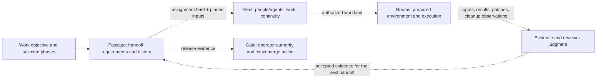

# Passage: freedom within work, evidence at the handoffs

Status: design for discussion, with a small local CLI specimen. 2026-09-14.
The composition below is a proposal; the command does not yet connect the tools.

## What we are trying to make possible

An agent can investigate, experiment, revise a design, implement, and test using
whatever methods suit the work. When another responsibility takes over, it can
tell what was done, which inputs were used, what evidence exists, and what remains
uncertain. A new worker or a replacement host should not need the conversation
reconstructed from scratch.

Passage is the name for that lifecycle and its handoff contracts. Michael selected
the name after discussing the broader lifecycle that the initial Fleet POC did
not implement. His subsequent direction is **design thoughts and a light POC for
closer inspection**, grounded in Rooms #125, with eventual reconciliation across
the tools. This is not a mandate to install another scheduler or adopt this file
format everywhere.

The earlier work is preserved. This branch starts at Workbench
[#351](https://github.com/itsHabib/workbench/pull/351),
`8fae5fde1e065f06c2f32b2d9bf4563b5aa40eb2`, including its optional Fleet request
admission, tests and demo. [#352](https://github.com/itsHabib/workbench/pull/352)
explores a parallel Fleet dispatch admission; it is not silently combined here.
The original [Relay brief](https://github.com/itsHabib/relay/blob/abfae4f5c54d65fda92437137c86ca4ff6de98dc/briefs/2026-09-14-sdlc-as-pipeline.md)
and its raw appendices remain the source of intent.

## The high-level composition

Dashed connections are intended seams, not implemented integrations in Passage.
Rooms may serve any phase: discovery experiments, implementation feedback, or
verification. Fleet can coordinate a desktop worker without Rooms. A developer
can use Passage alone to inspect a work record. No stage requires a model call.

| Responsibility | Owner | What Passage should reuse |
| --- | --- | --- |
| What outcome and work exist | Work brief; optional dossier project/task | A stable work reference, not a second ticket tracker |
| Role responsibilities | Editable cards; optional Org directory | Prose and attribution, not a compulsory org chart |
| Who is working, placement, continuity | Fleet | Existing assignment, occupancy and handoff records |
| Where commands execute | Local checkout or Rooms | Existing environment and workload contracts |
| What happened | Producer artifacts, logs and receipts | Original bytes and source identities |
| Whether evidence answers the question | Receiving worker/verifier and deterministic checks | An attributed judgment with its basis and limitations |
| What is needed at a phase transition | Passage | The work's selected requirements and accepted evidence |
| Whether a merge is authorized | Gate plus operator grant | Exact-head Gate action and outcome; never a Passage permission token |
| Durable driver execution history | Existing driverstate mechanism | Keep its own lifecycle; do not rename driver events into SDLC phases |

This follows the Workbench charter: compose through artifacts and CLI boundaries;
do not import another tool's decision code. Passage needs a command because the
requested lifecycle is broader than Fleet placement. The small specimen's record
is private to Passage, not a proposed portfolio-wide receipt schema.

## The lifecycle, including design and plan

Select the phases that the work warrants. The example separates design (what and
why) from plan (how to demonstrate success); they can be combined for smaller
work. A typo fix need not manufacture a discovery report. Choose the shorter
contract before starting rather than pretending skipped work was verified.

| Phase | Freedom inside | Useful handoff output | Receiving question |
| --- | --- | --- | --- |
| Discovery | Read, search, compare, run probes | Sources, constraints, examples, uncertainty | Do we know enough to make this decision? |
| Design | Explore alternatives and change approach | Decisions, trade-offs, API/data boundaries | Is the approach coherent and worth implementing? |
| Plan | Choose environments, workloads and feedback | Scope, success/failure cases, execution needs, escalation conditions | Can a worker act and can someone tell whether it worked? |
| Implementation | Edit, experiment, test, retry | Exact revision, artifacts, reproducible check evidence | Is there a concrete result ready to challenge? |
| Verification | Challenge premise and behavior, probe failures | Findings and acceptance judgment for the selected inputs | What has been established, what failed, and what is still unknown? |
| Release | Run the existing authorized release process | Gate action, merge/deployment result, residuals | What actually changed in the target system? |

A receipt does not mean a human approval at every phase. Many checks are
deterministic; others are assigned to a capable worker. Human decisions stay where
scope, uncertainty, spend or authority requires them. Passage cannot infer quality
from file existence, a passing command or an agent saying "done."

## Rooms #125: the concrete seam

Read at Rooms head `e5ae31117e874efaa05783fbbea4f72a224f58cd`:

- [Cloud runner](https://github.com/itsHabib/rooms/blob/e5ae31117e874efaa05783fbbea4f72a224f58cd/examples/cloud-lab.rs):
  hashes the binary, snapshot, backing image, toolstore and command; retains raw
  results; checks result count, exit/status, optional expected patch, and host
  cleanup. It runs workloads on an existing host; it does not provision hosts,
  start model agents, or choose a semantically correct candidate.
- [Reproduction and recovery guide](https://github.com/itsHabib/rooms/blob/e5ae31117e874efaa05783fbbea4f72a224f58cd/docs/experiments/cloud-lab.md):
  distinguishes preparation, execution, readiness and cleanup. Its Spot-loss run
  uses a durable Fleet checkpoint and a coordinator; automatic host replacement
  was not demonstrated.
- [Recorded Go run](https://github.com/itsHabib/rooms/blob/e5ae31117e874efaa05783fbbea4f72a224f58cd/docs/experiments/cloud-results/ci-run-0.json):
  reports 32 successful receipts, elapsed time and cleanup observations. This
  summary alone does not bind every package and artifact needed for admission.
- [Fleet checkpoint](https://github.com/itsHabib/rooms/blob/e5ae31117e874efaa05783fbbea4f72a224f58cd/docs/experiments/cloud-results/chaos-fleet-checkpoint.json):
  names the snapshot hash, source revision, expected patch and interrupted attempt.
  It explicitly says no completion receipt exists and that recovery replays work.

The desired connection is a **specific workload requirement** consuming the
original evidence bundle. For example: "Verify these frozen packages at this
revision in this environment, collect each result, and account for cleanup."

| Handoff element | Concrete source | Check before treating it as satisfied |
| --- | --- | --- |
| Work and attempt identity | Assignment plus workload/matrix definition | Belongs to this requested attempt; replacement gets a new attempt identity |
| Code input | Frozen checkout revision/package list | Matches the selected subject and covers the requested workload |
| Environment | Rooms `inputs.json` and snapshot/image/toolstore digests | Matches the environment named by the requirement |
| Execution | Each guest `result.json`, raw log and collected output | Expected cases exist and individually satisfy the required result conditions |
| Candidate output | Original patch/artifact plus digest | Matches the selected candidate; applying a patch produces a new revision to verify |
| Resource outcome | Host/runtime cleanup observations | Known released resources, or explicit unresolved cleanup responsibility |
| Acceptance | Receiving judgment over the bundle | Adequate for this question, with failures and limitations preserved |

Do not turn `execution_valid: true` into `verification: pass` by renaming a field.
Use the existing Rooms runner's interpretation as execution evidence and preserve
the raw packet for the receiver. A future adapter must check identities and
completeness for one real consumer. No universal Rooms-to-Passage adapter is built
in this POC, and no new cloud experiment was run for it.

## Repair and recovery

The work identity should outlive individual workers, branches and machine attempts.
An accepted design may feed several code changes; an execution attempt may fail
without invalidating that design. An implementation fix invalidates evidence bound
to its old code revision. A changed requirement may invalidate the design itself.

For the specimen, a work record is bound to one local root and an ordered selection
of phases. Reopening an earlier phase preserves every historical event and clears
the active downstream admissions. This deliberately conservative rule is easy to
inspect. Dependency-specific reuse, multiple PRs under one design, and merging
separate work records are future design questions, not implemented capabilities.

For host loss, keep "execution interrupted" separate from "phase finished":

1. Retain the outside-host checkpoint and available partial artifacts.
2. Establish what resources and effects remain uncertain.
3. Have the existing owner arrange an authorized replacement attempt.
4. Recheck frozen input identities and execute the unfinished workload.
5. Admit only the new attempt's sufficient evidence; keep the interrupted one.

Passage records the evidence decision; Fleet coordinates responsibility; Rooms
owns execution artifacts; provider lifecycle/spend remains separately authorized.
Neither a dead process nor a missing host automatically proves quiescence of all
effects. A phase transition is not a cloud provisioning command.

## What the light POC actually does

[`cmd/passage`](../../../cmd/passage/README.md) reads a selected contract, records
attributed pass/fail judgments, and checks evidence before advancing. File inputs
are SHA-256 bound; code phases also bind a clean Git HEAD. Evidence text is copied
into the record so a later overwritten log does not rewrite history.

It implements `init`, `status`, `check`, `history`, `record`, `advance`, and
`reopen`. Mutations require the revision the caller observed. A concurrent writer
or a lost-response retry cannot silently advance a second time. Publication is
one replacement of a local record under an exclusive lock. Reads replay its
history and check earlier accepted inputs for drift.

The six-phase demo includes a real failing Go test, a fix, new passing evidence,
completion of the selected record, a changed design and a reopen. Document
judgments, the verifying participant and the release result are explicitly
scripted. It is a discussion specimen, not proof of independent review, usefulness
to real workers, remote freshness, durable cross-host coordination or release.

The inherited Fleet POC remains separately runnable. Passage does not yet call
its request admission. Keeping that seam visible lets us decide whether Fleet
should consume a Passage packet or whether a lead should compose the two CLIs.

## What to decide together before widening it

1. **What counts as the receiving contract?** One work-level brief with selected
   requirements is the starting proposal. Whether to revise that contract in
   place needs explicit versioning; the specimen freezes it at init.
2. **What does an actual receiver need?** Try one real implementation → verification
   handoff with the original Rooms evidence and the inherited Fleet admission.
   Measure missed evidence and operator reconstruction, not just passing parsing.
3. **Where should evidence interpretation live?** Prefer the producer's existing
   format plus a small consumer-specific check. Extract shared types only after
   two consumers actually need identical vocabulary.
4. **Where is enforcement real?** The CLI refuses unsupported transitions, but an
   unrestricted agent can work outside it. A receiver must require the admitted
   packet; Gate and runtime effect boundaries enforce their own actions.
5. **How much state is justified?** A small local record is enough to inspect the
   idea. Adopt an existing journal or durable service only when cross-host writers,
   larger evidence bundles or actual recovery needs justify it.

The next useful result is a jointly inspected contract and a single composed
handoff, not a general workflow language or another engine.
