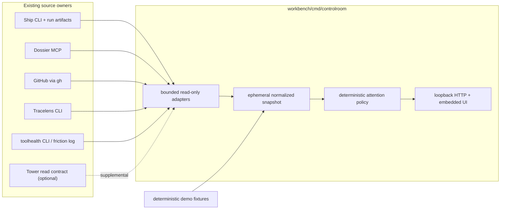

# Portfolio Control Room — Technical Design Document

**Status:** accepted — reviewed implementation foundation
**Owner:** @itsHabib
**Date:** 2026-07-12
**Related:** [`docs/DESIGN.md`](../../DESIGN.md), portfolio-root `docs/portfolio-as-tools.md` (operator-local corpus), dossier project `workbench`, Ship `docs/features/observability/spec.md`, Tracelens `docs/features/agent-reliability-lab/completion.md`

> **Reviewers — focus areas:** challenge the `cmd/controlroom` product-home choice and the Playwright-only testing exception; the read-only process/MCP boundaries in §4 and §6; the source-honesty and partial-failure model in §7–§8; and the deterministic attention policy in §9.

## 1. Problem & hypothesis

The portfolio's operating truth is split across Ship workflow and driver state, Dossier tasks, GitHub pull requests, Tracelens reports, Tower worktree observations, and the append-only friction log. The existing `/wip`, `/health`, and `/status` skills join some of those stores on demand, but the operator still has no single visual surface that answers what is running, what is stuck, what needs review, what agents are doing badly, and what deserves attention next.

The hypothesis is that a storeless, read-mostly local control room can make the portfolio legible without creating another owner of work or orchestration state. The product earns its place if a five-minute demo tells the complete healthy-to-on-fire story from deterministic fixtures, then switches to real local state while showing unavailable and stale fields honestly.

### Non-goals

- No chat UI, agent dispatcher, workflow engine, write controls, or background daemon.
- No copied source-of-truth database, durable cache, or direct reads of Ship/Tower/Dossier stores.
- No provider or cost comparison when the producer did not record comparable telemetry.
- No raw prompt, credential, or trace browser. Drill-down exposes normalized findings and safe evidence pointers.
- No cross-repository Go/TypeScript imports. Source tools remain separately buildable and releasable.
- No replacement for `/wip`, `/health`, `/status`, or `/shipped`; the control room is their visual observability peer.

## 2. Functional & non-functional requirements

### Functional requirements

1. Show active and recent Ship workflow and driver runs with runtime/provider when recorded, phase/status, duration/age, repository/task/branch, and a policy-derived stale/on-fire explanation.
2. Show Dossier claimed, in-progress, blocked, and ready tasks with phase, dependency, artifact, and policy-derived stale-claim context.
3. Show operator-authored portfolio PRs with repository, branch, author, age, draft/ready state, CI, review state, unresolved review threads, mergeability, and a concrete next action.
4. Analyze recent Ship traces with Tracelens on demand and show verdict, finding class, severity, evidence locus, and telemetry availability without inventing missing values.
5. Show recent friction grouped by tool with severity, recurrence, last occurrence, and one-line pain; distinguish accumulated friction from a live incident.
6. Produce an explicit, deterministic attention queue split into urgent, actionable, waiting, and informational items, with score and reason.
7. Filter by repository/project and status/severity; support manual refresh and safe 60-second automatic refresh.
8. Provide useful loading, empty, degraded, disconnected, and partial-source-failure states.
9. Deep-link to HTTPS PRs/reports, expose copyable local paths, and offer `vscode://file/` links only for validated workspace paths.
10. Support `demo` mode from deterministic fixtures and `real` mode from local tools, with no write endpoints in either mode.

### Non-functional requirements

| Concern | Target |
|---|---|
| Startup | First demo snapshot rendered within 1 second on the target laptop; real mode shell visible within 2 seconds and progressively settles sources. |
| Refresh | Core sources publish within a 15-second deadline. Slow diagnostic enrichers have a separate 35-second deadline and may publish a later immutable generation. Overlapping generations are cancelled. |
| Partial failure | One failed source never removes successful panels. Last successful in-memory snapshot may remain with an explicit stale badge until process exit. |
| Freshness | Every source and derived item carries `observed_at`; policy-derived stale labels name the threshold used. |
| Security | Bind `127.0.0.1` only; no mutation routes; strict CSP; escape text; redact process errors; no arbitrary-file serving; no secrets/raw traces committed. |
| Runtime dependencies | Production Go remains standard-library-only. Existing local CLIs are optional real-mode dependencies discovered from explicit config. |
| Test dependencies | Playwright is an explicit Node/CI infrastructure cost permitted only under `cmd/controlroom/e2e`; an exact version and lockfile are maintained there and never linked into the production binary. |
| Determinism | Demo fixtures, ranking, source degradation, and screenshots are clock-injected and repeatable. |
| Portability | Windows is the verified v1 host; path/process abstractions and fixtures remain OS-neutral where practical. |

## 3. Architecture overview

`controlroom` is a new Workbench command, not a new repository. Workbench's charter admits new infra planes and POCs by default; Control Room is an Observability-shaped projection and does not acquire the decision logic or state of its producers.



### Proposed layout

```text
cmd/controlroom/
  main.go
  CLAUDE.md
  README.md
  docs/DESIGN.md
  internal/
    app/           collection orchestration and clock
    source/        ship, dossier, github, tracelens, friction, tower adapters
    model/         normalized ephemeral read model
    attention/     deterministic ranking policy
    web/           handlers and embedded static assets
  testdata/contracts/<source>/
  testdata/demo/
  e2e/             Playwright-only package, tests, screenshot helper
docs/features/portfolio-control-room/
  spec.md
  runbook.md
  demo-script.md
  screenshots/
```

## 4. Key decisions & trade-offs

### D1 — Home: `workbench/cmd/controlroom`

**Choice:** ship as a Workbench command with private internals.

**Alternative:** a standalone React/TypeScript repository, or extending Tower. Rejected: the product is a local workbench observability plane with no independent public future yet; a separate repo adds release/deploy seams. Tower's locked capability is the worktree/PR fleet and cannot own Ship, Dossier, reliability, and friction without becoming a god app. Extract only if Control Room earns a separate release cadence or non-Go runtime.

### D2 — Storeless projection, not a unified backend

**Choice:** collect into one in-memory snapshot per refresh; retain only the last successful snapshot in process memory. Producers remain authoritative.

**Alternative:** SQLite/cache/event ingestion. Rejected: it creates freshness reconciliation, migration, and ownership work before the need exists. Restarting the process deliberately loses the cache.

### D3 — Process/MCP boundaries, never sibling imports or stores

**Choice:** execute documented CLI JSON contracts with `exec.CommandContext`; speak Dossier's stdio MCP contract; read Ship's documented run artifacts only for evidence paths; query GitHub through `gh`.

**Alternative:** import sibling packages, read SQLite/markdown directly, or copy artifacts to a neutral directory. Rejected by Workbench's boundary law and because it duplicates producer parsing/semantics. Paths and commands are explicit config, never guessed from source internals.

### D4 — Close Ship discovery and observability gaps at the owner seam

**Choice:** add additive `ship driver list --json`, backed by existing `DriverService.listDriverRuns()`, as the single Control Room consumer contract. Include durable run/stream fields, each stream's exact `specPath`, and timestamps; do not expose mutation/tick behavior. Also enrich Ship workflow list/detail JSON with exact `docPath` plus owner-normalized runtime, provider, model, duration, and evidence availability across local, cloud, and rooms runs.

**Alternative:** scan `driver.md`, query Ship SQLite, call `driver_run` to refresh, or parse `result.json` in Control Room. Rejected: direct store/artifact parsing bypasses Ship's semantics and `driver_run` mutates tick leases and can dispatch work. The two Ship changes are prerequisite owner contracts, delivered as separate PR-sized tasks.

### D5 — GitHub owns the PR panel; Tower is supplemental

**Choice:** inventory open PRs and fetch CI/review/mergeability/unresolved-thread state through `gh`; optionally join Tower's read-only `ls --json --no-reconcile` local worktree data by canonical repo + branch.

**Alternative:** treat Tower as the PR authority. Rejected: Tower only sees PRs attached to registered worktrees and does not expose draft, mergeability, review decision, unresolved threads, or snapshot freshness.

### D6 — Tracelens remains stateless

**Choice:** analyze up to the five newest eligible Ship traces in the slow enrichment lane and retain results only in the current snapshot. A trace is eligible when it belongs to a normalized workflow run (not a driver container), the Ship receipt is current, the run is terminal, Ship reports trace evidence available, and `updated_at` is within the preceding 14 days. Selection sorts `updated_at` descending, then stable run ID. Drill-down reuses that diagnosis or invokes `tracelens ship -json <run>` synchronously with a 10-second bound and a visible loading state. A timeout yields an unavailable diagnosis. Rich drill-down may generate a temporary Markdown report under the process temp directory, never in a new report store.

**Alternative:** invent recent-analysis or provider-comparison APIs. Rejected: Tracelens exposes neither. Current Ship decoders do not record per-step cost/tokens/latency, so cost hotspots and honest provider comparison remain unavailable for those traces.

### D7 — Stdlib production UI; Playwright test-only exception

**Choice:** `net/http`, `embed`, a static application shell, vanilla ES modules, and CSS. Static assets contain no inline scripts or styles and fetch the versioned JSON API. Playwright is an acknowledged Node/CI dependency: `cmd/controlroom/e2e` owns an exact package version and `package-lock.json`; Control Room maintainers update it through explicit dependency PRs that must keep E2E green.

**Alternative:** React/Vite production dependencies or non-browser handler tests only. Rejected: the former is unnecessary for a single dense local surface; the latter cannot satisfy the required browser-flow validation. The repository charter is amended narrowly: production remains stdlib-only, browser verification may use pinned Playwright.

### D8 — Ranking is explicit product policy

**Choice:** keep source collection factual and run a pure ranking function over normalized items. Each attention item includes category, numeric score, stable policy rule ID, explanation, and evidence links.

**Alternative:** model-generated prioritization. Rejected: the daily queue must be reproducible, testable, and safe when sources are partial. Models may summarize friction inside the existing toolhealth boundary, but never set attention order.

## 5. Data model

The read model is presentation-owned and stays private to `cmd/controlroom`; it is not promoted into Workbench `contracts`.

```go
type Snapshot struct {
    Version      int             `json:"version"`
    Mode         string          `json:"mode"` // demo | real
    GeneratedAt  time.Time       `json:"generated_at"`
    Sources      []SourceReceipt `json:"sources"`
    Runs         []Run           `json:"runs"`
    Tasks        []Task          `json:"tasks"`
    PullRequests []PullRequest   `json:"pull_requests"`
    Reliability  []Diagnosis     `json:"reliability"`
    ToolHealth   []ToolHealth    `json:"tool_health"`
    Attention    []AttentionItem `json:"attention"`
    Repositories []string        `json:"repositories"`
}

type SourceReceipt struct {
    Source     string    `json:"source"`
    State      string    `json:"state"` // loading | ok | degraded | unavailable | stale
    ObservedAt time.Time `json:"observed_at"`
    DurationMS int64     `json:"duration_ms"`
    ErrorCode  string    `json:"error_code,omitempty"`
    Message    string    `json:"message,omitempty"` // sanitized, operator-safe
}

type Availability[T any] struct {
    State string `json:"state"` // available | unknown | unavailable
    Value *T     `json:"value,omitempty"`
}

type Diagnosis struct {
    RunID       string                `json:"run_id"`
    Verdict     string                `json:"verdict"`
    Tier        string                `json:"tier"`
    Dialect     string                `json:"dialect"`
    Findings    []Finding             `json:"findings"`
    Report      Availability[SafeLink] `json:"report"`
    Evidence    []SafeLink             `json:"evidence"`
    InputTokens Availability[int64]    `json:"input_tokens"`
    OutputTokens Availability[int64]   `json:"output_tokens"`
    CostUSD     Availability[float64]  `json:"cost_usd"`
    LatencyMS   Availability[int64]    `json:"latency_ms"`
}
```

Normalized records carry stable IDs, source ownership, safe links, and `observed_at`. Fields not present in the producer use `Availability`, never zero-value inference.

A receipt is current only when it was observed in the publishing generation and its state is `ok` or `degraded`; `degraded` means the source returned a current, explicitly partial result. Retained records always use `stale`, even when the latest collection attempt is also represented by a separate `unavailable` receipt.

- `Run`: workflow/driver ID, source kind, repo/project/task/spec, branch, durable status, phase, requested/actual runtime-provider-model when present, created/updated/started/ended, derived duration, derived liveness label, failure category/detail, evidence links.
- `Task`: Dossier ID/slug/title/project/phase/status/assignee, dependencies, reverse blockers, timestamps, artifact links, derived liveness label.
- `PullRequest`: repo/number/title/url/author/head/base, draft, created/updated, checks, review decision, outstanding reviewer requests, unresolved thread count, mergeability, `detail_state = complete | truncated | unknown`, and next factual condition.
- `Diagnosis`: the explicit shape above; absent cost/token/latency telemetry remains `unknown` or `unavailable`, never numeric zero.
- `ToolHealth`: tool, worst severity, recurrence, last occurrence, pain lines, and `kind = accumulated_friction`; it never masquerades as a live incident.
- `AttentionItem`: stable ID, category, score, rule ID, title, reason, repo/project, and links.

No raw events, prompts, secrets, or arbitrary local file contents enter the snapshot.

## 6. API and command contracts

### Control Room CLI

```text
controlroom serve \
  --mode demo|real \
  --addr 127.0.0.1:4317 \
  --workspace-root %USERPROFILE%\pers \
  --dossier-corpus %USERPROFILE%\pers\dossier-state \
  --github-scope user:<login> \
  --refresh 60s \
  --config <optional-json>

controlroom snapshot --mode demo|real --json
```

Configuration names executable paths/argv and source timeouts explicitly. Defaults may locate executables on `PATH`, but never derive sibling store paths. Real mode requires one to four GitHub scope entries, each `user:<login>`, `org:<login>`, or `repo:<owner/name>`; zero or more than four is a startup configuration error, and no ambiguous owner kind or unscoped PR search is permitted. `serve` refuses non-loopback addresses unless a future separately reviewed flag authorizes them. It prints the canonical `http://127.0.0.1:<port>` URL and rejects any other HTTP `Host` value; `localhost` is deliberately not an accepted alias.

Real mode requires `gh >= 2.90.0` and reports an unavailable GitHub receipt when the startup version check fails. The GitHub adapter ignores additive fields it does not understand and treats missing known fields as `unknown` instead of failing the whole response.

### HTTP API

All routes are GET/HEAD; any mutation method returns `405`.

```text
GET /                         embedded application shell
GET /api/v1/snapshot?mode=demo|real&trigger=auto|manual&repository=&status=&severity=
GET /api/v1/runs/{id}/diagnosis
GET /api/v1/prs/{owner}/{repo}/{number}
GET /healthz                  process liveness only
```

`snapshot` returns one `Snapshot`. `mode` selects the configured adapter set (`demo` fixtures or `real` tools) before collection. `trigger` is required: the timer sends `auto`, while the refresh button sends `manual`; only `manual` may request the one Dossier breaker half-open probe. The repository, status, and severity parameters are presentation filters applied after collection; they cannot change source queries or state. A refresh request cancels the previous in-flight refresh. The server coalesces only requests with the same collection identity: mode, trigger class, and SHA-256 of canonical JSON containing adapter names, absolute executable paths, argv, timeouts, GitHub scopes, Dossier corpus, and workspace root. Presentation filters are excluded. Demo and real, or auto and manual, can never share an in-flight result when breaker behavior differs.

### Source contracts

| Source | Read contract | Notes |
|---|---|---|
| Ship workflows | enriched `ship list --json`, `ship status <wf> --json` | Owner-normalized runtime/provider/model/duration/evidence availability for local, cloud, and rooms; additive-field tolerant; no `result.json` or DB fallback. |
| Ship drivers | proposed `ship driver list --json`; existing point `driver status --json` | CLI JSON is the Control Room consumer contract; no tick/dispatch calls. |
| Dossier | stdio MCP `project.list`, `project.overview`, `phase.list`, `task.list`, `task.get`, `artifact.list` | `serve` keeps one long-lived, handshaken child; `snapshot` starts one child and closes it. EOF/exit/call failure marks unavailable; the next refresh makes at most one start attempt. After three consecutive start/handshake/first-call failures, automatic probes pause for five minutes; one manual refresh may perform one half-open probe. Success resets the breaker. No markdown fallback. |
| GitHub | `gh api user --jq .login`; then the versioned batched GraphQL query defined below through `gh api graphql` | GitHub is authoritative; no per-PR `gh pr view` subprocess fan-out. |
| Tracelens | `tracelens ship -json <run-ref>` and optional `report` | Analyze at most five recent eligible traces per diagnostic generation; no recent-analysis index or durable cache. |
| Tool health | existing `toolhealth.exe` board; fixture-backed tolerant parser | Degrade if unavailable or its text contract drifts; do not duplicate its local-model bucketing. |
| Tower | optional `tower ls --json --no-reconcile` | Supplemental local branch/path context only; unavailable is normal in v1. |

#### GitHub batched query

After resolving the authenticated login once, the adapter pages GraphQL search through `gh api graphql` once per configured scope, preserving its explicit qualifier: `user:<login>`, `org:<login>`, or `repo:<owner/name>`, always combined with `is:pr is:open author:<login> archived:false`. It never issues an unscoped author query, and de-duplicates node IDs across scopes. The embedded, versioned query uses `search(type: ISSUE, first: 50, after: $cursor)` and selects each pull request's repository `nameWithOwner`, number, title, URL, author, base/head names and head OID, draft/state/timestamps, `mergeable`, `mergeStateStatus`, `reviewDecision`, `reviewRequests(first: 1) { totalCount }`, latest commit `statusCheckRollup.contexts(first: 100)` with `pageInfo`, and `reviewThreads(first: 100)` with each thread's `isResolved` plus `pageInfo`.

The adapter fetches scopes in stable order and pages them round-robin, at most four total 50-PR pages under the source's 10-second bound. An unvisited next page keeps the GitHub receipt in the valid current-partial state `degraded` with `error_code = "inventory_truncated"`; PRs beyond 200 are not represented and no aggregate claims completeness. A failed/timed-out later page retains completed pages, marks the receipt `degraded` with a typed error code, and emits an informational source item. A PR whose checks or review-thread connection reports `hasNextPage` is retained with `detail_state = truncated`: factual negative evidence already present may trigger `ci_failed`, `changes_requested`, or `unresolved_threads`, but review-needed, waiting, and merge-ready rules cannot fire; an informational `pr.detail_truncated` item explains the gap. This avoids per-PR subprocesses, unbounded nested pagination, unrelated repositories, invalid receipt states, and silent completeness assumptions at GitHub's 100-context ceiling.

## 7. Key flows

### Initial demo load

1. Browser requests demo snapshot.
2. Fixture adapter loads one healthy run, one policy-stale/on-fire run, one failed-CI PR, one blocked task, Tracelens findings, and friction records using an injected clock.
3. Normalizer produces the same read model used by real mode.
4. Attention policy ranks the items and the UI paints the control-room overview, source freshness, and top three actions.

### Real refresh with partial failure

1. Collector assigns a monotonically increasing generation token and starts bounded core calls for Ship, Dossier, GitHub, and optional Tower.
2. Each adapter returns records plus a `SourceReceipt`; errors are sanitized and typed.
3. Core calls publish an immutable snapshot through `atomic.Pointer[Snapshot]` when all settle or at the 15-second deadline. A failed source contributes an unavailable receipt and, if present, last-successful records marked stale.
4. Tracelens and toolhealth then run as diagnostic enrichers with a shared 35-second bound. The core publish carries their last-successful payloads forward as `stale` while separate current-generation receipts read `loading`; if no prior payload exists, their panels show loading-empty.
5. One enrichment coordinator uses `sync.WaitGroup` plus buffered per-enricher result channels to rendezvous both calls or the deadline. It cancels an unsettled call, overlays settled results onto the immutable core-generation base, retains stale payload for any failed/timed-out enricher, and performs exactly one `atomic.Pointer[Snapshot].Store` if the generation token is still current. A failed/timed-out enricher's final receipt becomes `stale` when a prior payload was retained, or `unavailable` when none exists. A newer refresh cancels and supersedes the coordinator.
6. Ranking runs for each publish. Missing facts never produce a positive readiness conclusion, and stale retained records are excluded from fresh action conclusions.
7. UI updates panels independently and announces degraded sources without blanking healthy data.

### Run and Tracelens drill-down

1. User opens a run row.
2. API validates the run ID against the current snapshot and resolves only the configured Ship runs directory.
3. If the snapshot already contains a diagnosis, the API returns it. Otherwise the UI shows loading while the API invokes Tracelens with a 10-second bound; there is no second cache. Timeout or unsupported input returns a typed unavailable diagnosis.
4. UI shows verdict, ranked findings, evidence locus, repair text when available, and explicit telemetry gaps.
5. The raw trace is never returned to the browser.

### PR drill-down

1. User opens a PR row.
2. API resolves the already-known owner/repo/number from the immutable snapshot; drill-down does not perform a hidden live collection.
3. The response envelope includes the pull request, its GitHub `SourceReceipt`, and an explicit `stale` flag alongside checks, reviews, outstanding reviewer requests, unresolved thread count, merge state, and safe GitHub URLs.
4. Failed CI and unresolved findings remain separate conditions; stale, truncated, empty, or unknown review state does not become approval or an actionable readiness label.

### Automatic refresh

1. Browser schedules the next refresh only after the previous one settles.
2. Hidden tabs pause automatic refresh; manual refresh remains available.
3. Server coalesces duplicate calls and cancels superseded work through context.

## 8. Concurrency, consistency, and failure model

- Core collection is fan-out/fan-in with per-source bounds and a 15-second deadline; diagnostic enrichment has a 35-second deadline. A generation token prevents superseded work from publishing.
- Snapshots are immutable after publication and swapped through `atomic.Pointer[Snapshot]`. Readers never observe a half-updated slice.
- No cross-source transaction exists. `generated_at` is not an assertion that producer reads were simultaneous; each `SourceReceipt.observed_at` is authoritative for freshness.
- Dossier MCP corruption/unavailability fails the Dossier panel; there is no alternate markdown parser. Restart behavior follows the exact one-attempt/three-failure/five-minute breaker in §6.
- Ship CLI/store skew, missing owner-reported evidence, or malformed additive records degrade affected fields/rows, not unrelated sources. A completely malformed list response fails the Ship source rather than undercounting silently.
- GitHub rate/auth failures retain stale PR data with an unavailable receipt; mergeability/review unknowns never rank as ready-to-merge.
- Tracelens input/dialect failure creates an unavailable diagnosis for that run; it does not change Ship's run status.
- Toolhealth/Tower missing from the host is a normal degraded state. The UI explains how the source was configured and what remains available.
- Deep links accept only current-snapshot IDs/URLs and validated workspace-contained paths. Path validation requires an existing absolute path, applies `filepath.Abs`, `filepath.Clean`, and `filepath.EvalSymlinks` to it and the configured workspace root, then uses `filepath.Rel`; it rejects different volumes, `..`, and any relative path beginning with `..` plus a separator. No route accepts an arbitrary filesystem path or command.
- The application shell contains no inline script or style. Every response sets `Content-Security-Policy: default-src 'none'; script-src 'self'; style-src 'self'; connect-src 'self'; img-src 'self' data:; base-uri 'none'; form-action 'none'; frame-ancestors 'none'`.
- Raw child-process stderr never enters a snapshot. The browser receives a typed error code, optional exit code, and an allowlisted summary after absolute paths, usernames, and credential/token-like substrings are removed and the result is truncated to 200 characters.

## 9. Deterministic liveness and attention policy

Derived labels are explicitly Control Room policy, not producer state.

### Liveness rules

- `on_fire/retry_loop`: at least 3 failed runs of the same kind within 72 hours, grouped by the owner-reported normalized input-document identity (`docPath` for workflows; task/spec document path for drivers). Workflow and driver runs never combine into one count.
- `on_fire/stalled_active`: `pending|running|dispatching|dispatched` with no `updated_at` movement for 15 minutes. The UI labels this “Control Room policy: no source update for 15m,” not “Ship stale.”
- `live`: source movement within 3 days, an active run, or a linked open PR.
- `idle`: open work with no movement for 3–14 days.
- `stale_claim`: Dossier `claimed|in_progress` whose `updated_at` is older than 14 days with no linked open PR and no linked current Ship run updated within the preceding 14 days. Linkage is explicit: a run's owner-reported task/spec identity equals the Dossier task ID or slug, or the task carries an artifact URL for that exact PR/run. Title/body substring guesses never create a link.
- `blocked_no_path`: blocked task with no resolvable dependency/artifact explaining a path forward.

### Ranking rules

For each normalized run, task, or pull request, evaluate non-informational rules in descending score order and emit only the first match; one entity cannot occupy conflicting consequence queues. Informational source/detail context may coexist. Ties across entities sort by newest factual update, then stable ID.

| Rule ID | Category | Score | Condition / explanation |
|---|---:|---:|---|
| `run.retry_loop` | urgent | 100 | Repeated same-doc failures; includes count/window/latest cause. |
| `run.stalled_active` | urgent | 95 | Active/pending run exceeds the no-update threshold. |
| `pr.ci_failed` | urgent | 90 | GitHub receipt is current and at least one returned visible check completed with a failure conclusion; this negative fact remains valid if another detail connection is truncated. |
| `pr.changes_requested` | urgent | 85 | Current GitHub data reports `reviewDecision == CHANGES_REQUESTED`. |
| `task.blocked_no_path` | urgent | 80 | Blocked with no resolvable dependency/path. |
| `pr.unresolved_threads` | actionable | 75 | Current GitHub data returns one or more unresolved review threads; the observed negative fact remains valid if later thread pages are truncated. |
| `pr.review_needed` | actionable | 70 | GitHub receipt is current; `detail_state == complete`; PR is non-draft; at least one visible check exists and every visible check completed successfully; and `reviewDecision == REVIEW_REQUIRED` or requested reviewers are non-empty. Unknown or empty checks never qualify. |
| `pr.merge_ready` | actionable | 65 | GitHub receipt is current; `detail_state == complete`; PR is non-draft; at least one visible check exists and every visible check completed successfully; `reviewDecision == APPROVED`; requested reviewer count is zero; `mergeable == MERGEABLE`; `mergeStateStatus == CLEAN`; unresolved thread count is zero. Empty or unknown never qualifies, so this cannot overlap `pr.review_needed`. |
| `task.stale_claim` | actionable | 55 | Dossier reports `claimed|in_progress`, `updated_at` is older than 14 days, and no explicitly linked open PR or current Ship run was updated within 14 days. |
| `task.ready` | actionable | 40 | Dossier reports `status == "todo"` and every explicitly declared dependency is terminal-done. Missing/unknown dependency state never qualifies. |
| `pr.checks_running` | waiting | 30 | GitHub receipt is current; `detail_state == complete`; at least one visible check has `QUEUED`, `PENDING`, or `IN_PROGRESS`; no completed visible check failed; `reviewDecision != CHANGES_REQUESTED`; and unresolved thread count is zero. |
| `tool.accumulated_friction` | informational | 10–25 | Exact formula below; explicitly not a live incident. |
| `source.unavailable` | informational | 8 | Current-generation source receipt is `unavailable`; reason is the sanitized source error, never an inferred record problem. |
| `source.stale` | informational | 7 | A panel is displaying retained records or diagnostic payload from an earlier generation; asks the operator to revalidate. |
| `pr.detail_truncated` | informational | 6 | GitHub receipt is current and the PR has `detail_state == truncated`; names the saturated connection and suppresses positive readiness rules. |

`tool.accumulated_friction` uses `min(25, 10 + severity + recurrence + recency)`, where severity is P1=8, P2=5, P3=2, or unknown=0; recurrence is `min(4, max(0, session_count - 1))`; and recency is 3 when elapsed time since the last occurrence is at most 72 hours, 1 when it is greater than 72 and at most 336 hours, otherwise 0. The injected clock makes every term and tie-break reproducible in golden tests.

An attention item is current only when every source receipt supporting its conclusion is current. If any supporting receipt is retained/stale, the item is suppressed from urgent, actionable, and waiting queues and replaced by `source.stale`. Informational items derived from retained records, including accumulated friction, remain visible with `stale = true`; they cannot affect a higher-consequence queue, and `source.stale` always accompanies them. Source unavailability generates `source.unavailable`; it never fabricates a problem or readiness conclusion inside an absent source.

## 10. Rollout / implementation plan

| Phase | Goal | High-level tasks | Depends on | Scope | Gate |
|---|---|---|---|---:|---|
| 1 — Source contracts | Close owner-contract gaps and pin fixtures. | Separate Ship PRs for driver discovery and workflow observability enrichment; capture sanitized source fixtures; document config/privacy. | Design merged | 550–850 weighted LOC | Both Ship contracts merged and contract tests green. Phase 2 may start once their schemas are frozen, but Phase 4 cannot pass before merge. No artifact-parser fallback. |
| 2 — Read model and policy | Lock the presentation contract before UI/adapters diverge. | `Snapshot`, `SourceReceipt`, `Availability`, `Diagnosis`, attention/liveness policy, deterministic demo scenario, golden tests. | Phase 1 schemas frozen | 450–700 weighted LOC | JSON schema and ranking goldens reviewed; stale-source safety tests pass. |
| 3 — Vertical demo UI | Prove the complete visual story through the locked read model. | Static application shell; responsive six-panel UI; filters/refresh; run and PR drawers; loading/empty/degraded/disconnected states. | Phase 2 | 700–1000 weighted LOC | **VALIDATION GATE:** five-minute demo passes in browser; healthy/on-fire/degraded screenshots are coherent. This is the highest-risk phase. |
| 4 — Per-source real adapters | Read current local truth and fail independently. | One PR-sized task and contract/failure gate per source: Ship, Dossier, GitHub, Tracelens, toolhealth, optional Tower. | Phase 3 GO; both Ship PRs merged for Ship adapter | 700–1050 weighted LOC total | Every adapter passes its own fixtures, timeout, malformed-input, and source-receipt tests. Tasks are parallel-safe by source directory. |
| 5 — Composition and degraded mode | Join adapters without hiding partial truth. | Serialized adapter composition; core/enrichment generations; cancellation/coalescing; cross-source joins; stale suppression; real-mode smoke. | Phase 4 adapters | 450–700 weighted LOC | Injected source failures preserve healthy panels; superseded enrichers cannot publish; real mode reads available tools. |
| 6 — Hardening and handoff | Make default-branch product reproducible and demonstrable. | Playwright flows and pinned Node CI; security/path tests; runbook; demo script/screenshots; fresh-checkout verification; trace analysis and retrospective. | Phase 5 | 450–700 weighted LOC | CI green; every actionable canonical-reviewer finding resolved, or deferred to a linked Dossier task with independent reviewer acknowledgment; `agent:codex` runs the review-coordinator gate and records GO; merged main verified. |

Every implementation task remains PR-sized. Phase 4 adapters are parallel-safe only inside their assigned source directories. Phase 5 owns the sole cross-source composition seam and is therefore serialized.

## 11. Open questions

1. **Toolhealth machine output:** v1 may consume the existing human board with a tolerant fixture-backed parser. If implementation review rejects text parsing as too fragile, add `toolhealth -json` at its owner seam before the real adapter; do not reimplement the local-model bucketing in Control Room.
2. **Tower freshness:** v1 can treat Tower as optional and unavailable by default because its executable is not currently installed and its cached GitHub freshness is not exposed. A future owner change may add canonical repo identity and `observed_at`.

Neither changes the product direction or blocks Phase 3's vertical demo.

## 12. Validation plan

### Unit and contract tests

- Fixture tests for every adapter contract, additive fields, malformed records, timeout, missing executable, and sanitized errors.
- Normalization tests for unknown/unavailable fields, dependency resolution, reverse blockers, source timestamps, and no raw trace leakage.
- Golden ranking tests for every table rule (including informational source/detail rules), per-entity precedence/exclusivity, tie-breaker, missing-source behavior, retry-loop grouping, stale thresholds, and retained informational visibility.
- `httptest` coverage for method restrictions, CSP/Host validation, path validation, filters, required auto/manual trigger, canonical adapter fingerprinting, refresh cancellation/coalescing, breaker probing, and deep-link allowlists.

### Integration tests

- Fake executable/MCP harness composes at least Ship + Dossier + GitHub + Tracelens into one snapshot.
- One source fails/corrupts/times out while other panels and attention items remain correct.
- Dossier child EOF and process exit produce one unavailable receipt; concurrent refreshes perform one restart attempt; three failed sessions open the five-minute breaker; one manual half-open probe and success reset are covered.
- GitHub fixtures cover required `user`/`org`/`repo` scope validation and isolation, minimum-version failure, additive/missing fields, empty checks, valid degraded receipt/error codes, round-robin four-page cap, later-page timeout, saturated check/thread connections, and negative-evidence-vs-readiness policy.
- A superseded diagnostic generation cannot replace a newer core snapshot.
- A core refresh retains prior Tracelens/toolhealth payloads as stale while the new diagnostic receipts are loading; post-timeout receipts settle to stale-with-payload or unavailable-without-payload.
- Enrichers completing in either order or timing out produce one generation-checked store without one result overwriting the other.
- Real-mode smoke against explicit temporary fixtures proves no dependency on sibling source code or databases.

### Browser tests

- Initial demo load and source freshness.
- Repository/status/severity filtering.
- Degraded and disconnected source states.
- PR drill-down with failed CI and missing review.
- Run/Tracelens drill-down with findings and unavailable telemetry.
- Demo-mode deterministic scenario and real-mode switch.
- Laptop viewport plus one narrow responsive viewport.

### Release gate

```text
gofmt -l .
go vet ./...
golangci-lint run ./...
go test -race ./...
go build ./...
npm --prefix cmd/controlroom/e2e ci
npm --prefix cmd/controlroom/e2e test
```

Capture and commit healthy, degraded, and on-fire screenshots. Verify documented clean-start commands from a fresh checkout with no uncommitted configuration or secrets. Every implementation PR must have green CI, the canonical review requests, resolved actionable findings, and a final review-coordinator `GO` before merge.
