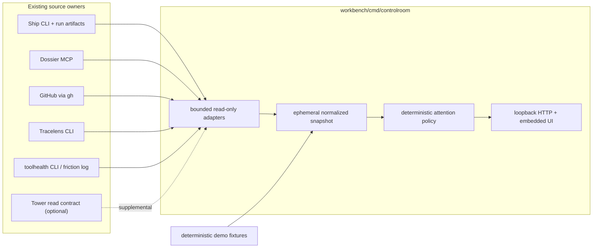

# Portfolio Control Room — Technical Design Document

**Status:** draft / proposal — the reviewed design this initiative builds from
**Owner:** @itsHabib
**Date:** 2026-07-12
**Related:** [`docs/DESIGN.md`](../../DESIGN.md), portfolio-root `docs/portfolio-as-tools.md` (operator-local corpus), dossier project `workbench`, Ship `docs/features/observability/spec.md`, Tracelens `docs/features/agent-reliability-lab/completion.md`

> **Reviewers — focus areas:** challenge the `cmd/controlroom` product-home choice and the Playwright-only testing exception; the read-only process/MCP boundaries in §4 and §6; the source-honesty and partial-failure model in §7–§8; and the deterministic attention policy in §9.

## 1. Problem & hypothesis

The portfolio's operating truth is split across Ship workflow and driver state, Dossier tasks, GitHub pull requests, Tracelens reports, Tower worktree observations, and the append-only friction log. The existing `/wip`, `/health`, and `/status` skills join some of those stores on demand, but the operator still has no single visual surface that answers what is running, what is stuck, what needs review, what agents are doing badly, and what deserves attention next.

The hypothesis is that a storeless, read-mostly local control room can make the portfolio legible without creating another owner of work or orchestration state. The product earns its place if a five-minute demo tells the complete healthy-to-on-fire story from deterministic fixtures, then switches to real local state while showing unavailable and stale fields honestly.

### Non-goals

- No chat UI, agent dispatcher, workflow engine, write controls, or background daemon.
- No copied source-of-truth database, durable cache, or direct reads of Ship/Tower/Dossier stores.
- No provider or cost comparison when the producer did not record comparable telemetry.
- No raw prompt, credential, or trace browser. Drill-down exposes normalized findings and safe evidence pointers.
- No cross-repository Go/TypeScript imports. Source tools remain separately buildable and releasable.
- No replacement for `/wip`, `/health`, `/status`, or `/shipped`; the control room is their visual observability peer.

## 2. Functional & non-functional requirements

### Functional requirements

1. Show active and recent Ship workflow and driver runs with runtime/provider when recorded, phase/status, duration/age, repository/task/branch, and a policy-derived stale/on-fire explanation.
2. Show Dossier claimed, in-progress, blocked, and ready tasks with phase, dependency, artifact, and policy-derived stale-claim context.
3. Show operator-authored portfolio PRs with repository, branch, author, age, draft/ready state, CI, review state, unresolved review threads, mergeability, and a concrete next action.
4. Analyze recent Ship traces with Tracelens on demand and show verdict, finding class, severity, evidence locus, and telemetry availability without inventing missing values.
5. Show recent friction grouped by tool with severity, recurrence, last occurrence, and one-line pain; distinguish accumulated friction from a live incident.
6. Produce an explicit, deterministic attention queue split into urgent, actionable, waiting, and informational items, with score and reason.
7. Filter by repository/project and status/severity; support manual refresh and safe 60-second automatic refresh.
8. Provide useful loading, empty, degraded, disconnected, and partial-source-failure states.
9. Deep-link to HTTPS PRs/reports, expose copyable local paths, and offer `vscode://file/` links only for validated workspace paths.
10. Support `demo` mode from deterministic fixtures and `real` mode from local tools, with no write endpoints in either mode.

### Non-functional requirements

| Concern | Target |
|---|---|
| Startup | First demo snapshot rendered within 1 second on the target laptop; real mode shell visible within 2 seconds and progressively settles sources. |
| Refresh | Each source has an independent timeout (default 10 seconds); total refresh deadline 15 seconds; overlapping refreshes are cancelled. |
| Partial failure | One failed source never removes successful panels. Last successful in-memory snapshot may remain with an explicit stale badge until process exit. |
| Freshness | Every source and derived item carries `observed_at`; policy-derived stale labels name the threshold used. |
| Security | Bind `127.0.0.1` only; no mutation routes; strict CSP; escape text; redact process errors; no arbitrary-file serving; no secrets/raw traces committed. |
| Runtime dependencies | Production Go remains standard-library-only. Existing local CLIs are optional real-mode dependencies discovered from explicit config. |
| Test dependencies | Pinned Playwright is permitted only under `cmd/controlroom/e2e`; it is not linked into the production binary. |
| Determinism | Demo fixtures, ranking, source degradation, and screenshots are clock-injected and repeatable. |
| Portability | Windows is the verified v1 host; path/process abstractions and fixtures remain OS-neutral where practical. |

## 3. Architecture overview

`controlroom` is a new Workbench command, not a new repository. Workbench's charter admits new infra planes and POCs by default; Control Room is an Observability-shaped projection and does not acquire the decision logic or state of its producers.



### Proposed layout

```text
cmd/controlroom/
  main.go
  CLAUDE.md
  README.md
  docs/DESIGN.md
  internal/
    app/           collection orchestration and clock
    source/        ship, dossier, github, tracelens, friction, tower adapters
    model/         normalized ephemeral read model
    attention/     deterministic ranking policy
    web/           handlers, templates, embedded assets
  testdata/contracts/<source>/
  testdata/demo/
  e2e/             Playwright-only package, tests, screenshot helper
docs/features/portfolio-control-room/
  spec.md
  runbook.md
  demo-script.md
  screenshots/
```

## 4. Key decisions & trade-offs

### D1 — Home: `workbench/cmd/controlroom`

**Choice:** ship as a Workbench command with private internals.

**Alternative:** a standalone React/TypeScript repository, or extending Tower. Rejected: the product is a local workbench observability plane with no independent public future yet; a separate repo adds release/deploy seams. Tower's locked capability is the worktree/PR fleet and cannot own Ship, Dossier, reliability, and friction without becoming a god app. Extract only if Control Room earns a separate release cadence or non-Go runtime.

### D2 — Storeless projection, not a unified backend

**Choice:** collect into one in-memory snapshot per refresh; retain only the last successful snapshot in process memory. Producers remain authoritative.

**Alternative:** SQLite/cache/event ingestion. Rejected: it creates freshness reconciliation, migration, and ownership work before the need exists. Restarting the process deliberately loses the cache.

### D3 — Process/MCP boundaries, never sibling imports or stores

**Choice:** execute documented CLI JSON contracts with `exec.CommandContext`; speak Dossier's stdio MCP contract; read Ship's documented run artifacts only for evidence paths; query GitHub through `gh`.

**Alternative:** import sibling packages, read SQLite/markdown directly, or copy artifacts to a neutral directory. Rejected by Workbench's boundary law and because it duplicates producer parsing/semantics. Paths and commands are explicit config, never guessed from source internals.

### D4 — Add Ship driver listing at the owner seam

**Choice:** add additive `ship driver list --json` and `list_driver_runs` MCP reads backed by existing `DriverService.listDriverRuns()`. Include current durable run/stream fields and timestamps; do not expose mutation/tick behavior.

**Alternative:** scan `driver.md`, query Ship SQLite, or call `driver_run` to refresh. Rejected: the first two bypass Ship's contract; the last mutates tick leases and can dispatch work. This is the only prerequisite source-contract change in v1.

### D5 — GitHub owns the PR panel; Tower is supplemental

**Choice:** inventory open PRs and fetch CI/review/mergeability/unresolved-thread state through `gh`; optionally join Tower's read-only `ls --json --no-reconcile` local worktree data by canonical repo + branch.

**Alternative:** treat Tower as the PR authority. Rejected: Tower only sees PRs attached to registered worktrees and does not expose draft, mergeability, review decision, unresolved threads, or snapshot freshness.

### D6 — Tracelens remains stateless

**Choice:** discover recent Ship traces, invoke `tracelens ship -json <run>` on demand, and cache results only in the current snapshot. Rich drill-down may generate a temporary Markdown report under the process temp directory, never in a new report store.

**Alternative:** invent recent-analysis or provider-comparison APIs. Rejected: Tracelens exposes neither. Current Ship decoders do not record per-step cost/tokens/latency, so cost hotspots and honest provider comparison remain unavailable for those traces.

### D7 — Stdlib production UI; Playwright test-only exception

**Choice:** `net/http`, `html/template`, `embed`, vanilla ES modules, and CSS. Pin Playwright only inside the E2E harness and CI job.

**Alternative:** React/Vite production dependencies or non-browser handler tests only. Rejected: the former is unnecessary for a single dense local surface; the latter cannot satisfy the required browser-flow validation. The repository charter is amended narrowly: production remains stdlib-only, browser verification may use pinned Playwright.

### D8 — Ranking is explicit product policy

**Choice:** keep source collection factual and run a pure ranking function over normalized items. Each attention item includes category, numeric score, stable policy rule ID, explanation, and evidence links.

**Alternative:** model-generated prioritization. Rejected: the daily queue must be reproducible, testable, and safe when sources are partial. Models may summarize friction inside the existing toolhealth boundary, but never set attention order.

## 5. Data model

The read model is presentation-owned and stays private to `cmd/controlroom`; it is not promoted into Workbench `contracts`.

```go
type Snapshot struct {
    Version      int             `json:"version"`
    Mode         string          `json:"mode"` // demo | real
    GeneratedAt  time.Time       `json:"generated_at"`
    Sources      []SourceReceipt `json:"sources"`
    Runs         []Run           `json:"runs"`
    Tasks        []Task          `json:"tasks"`
    PullRequests []PullRequest   `json:"pull_requests"`
    Reliability  []Diagnosis     `json:"reliability"`
    ToolHealth   []ToolHealth    `json:"tool_health"`
    Attention    []AttentionItem `json:"attention"`
    Repositories []string        `json:"repositories"`
}

type SourceReceipt struct {
    Source     string    `json:"source"`
    State      string    `json:"state"` // ok | degraded | unavailable
    ObservedAt time.Time `json:"observed_at"`
    DurationMS int64     `json:"duration_ms"`
    ErrorCode  string    `json:"error_code,omitempty"`
    Message    string    `json:"message,omitempty"` // sanitized, operator-safe
}

type Availability[T any] struct {
    State string `json:"state"` // available | unknown | unavailable
    Value *T     `json:"value,omitempty"`
}
```

Normalized records carry stable IDs, source ownership, safe links, and `observed_at`. Fields not present in the producer use `Availability`, never zero-value inference.

- `Run`: workflow/driver ID, source kind, repo/project/task/spec, branch, durable status, phase, requested/actual runtime-provider-model when present, created/updated/started/ended, derived duration, derived liveness label, failure category/detail, evidence links.
- `Task`: Dossier ID/slug/title/project/phase/status/assignee, dependencies, reverse blockers, timestamps, artifact links, derived liveness label.
- `PullRequest`: repo/number/title/url/author/head/base, draft, created/updated, checks, review decision, outstanding reviewer requests, unresolved thread count, mergeability, next factual condition.
- `Diagnosis`: run ID, Tracelens verdict/tier/findings, dialect, report/evidence pointer, availability of cost/token/latency fields.
- `ToolHealth`: tool, worst severity, recurrence, last occurrence, pain lines, and `kind = accumulated_friction`; it never masquerades as a live incident.
- `AttentionItem`: stable ID, category, score, rule ID, title, reason, repo/project, and links.

No raw events, prompts, secrets, or arbitrary local file contents enter the snapshot.

## 6. API and command contracts

### Control Room CLI

```text
controlroom serve \
  --mode demo|real \
  --addr 127.0.0.1:4317 \
  --workspace-root %USERPROFILE%\pers \
  --dossier-corpus %USERPROFILE%\pers\dossier-state \
  --refresh 60s \
  --config <optional-json>

controlroom snapshot --mode demo|real --json
```

Configuration names executable paths/argv and source timeouts explicitly. Defaults may locate executables on `PATH`, but never derive sibling store paths. `serve` refuses non-loopback addresses unless a future separately reviewed flag authorizes them.

### HTTP API

All routes are GET/HEAD; any mutation method returns `405`.

```text
GET /                         embedded application shell
GET /api/v1/snapshot?mode=demo|real&repository=&status=&severity=
GET /api/v1/runs/{id}/diagnosis
GET /api/v1/prs/{owner}/{repo}/{number}
GET /healthz                  process liveness only
```

`snapshot` returns one `Snapshot`. `mode` selects the configured adapter set (`demo` fixtures or `real` tools) before collection. The repository, status, and severity parameters are presentation filters applied after collection; they cannot change source queries or state. A refresh request cancels the previous in-flight refresh. The server coalesces concurrent identical refreshes.

### Source contracts

| Source | Read contract | Notes |
|---|---|---|
| Ship workflows | `ship list --json`, `ship status <wf> --json` | Additive-field tolerant; no direct DB. |
| Ship drivers | proposed `ship driver list --json`, `list_driver_runs`; existing point `driver status --json` | Read-only owner change; no tick/dispatch calls. |
| Dossier | stdio MCP `project.list`, `project.overview`, `phase.list`, `task.list`, `task.get`, `artifact.list` | Spawn `dossier serve --corpus`; no markdown fallback. |
| GitHub | `gh search prs --json`, `gh pr view --json`, paginated GraphQL review threads | GitHub is authoritative for PR inventory/detail. |
| Tracelens | `tracelens ship -json <run-ref>` and optional `report` | No recent-analysis index; analysis is on demand. |
| Tool health | existing `toolhealth.exe` board; fixture-backed tolerant parser | Degrade if unavailable or its text contract drifts; do not duplicate its local-model bucketing. |
| Tower | optional `tower ls --json --no-reconcile` | Supplemental local branch/path context only; unavailable is normal in v1. |

## 7. Key flows

### Initial demo load

1. Browser requests demo snapshot.
2. Fixture adapter loads one healthy run, one policy-stale/on-fire run, one failed-CI PR, one blocked task, Tracelens findings, and friction records using an injected clock.
3. Normalizer produces the same read model used by real mode.
4. Attention policy ranks the items and the UI paints the control-room overview, source freshness, and top three actions.

### Real refresh with partial failure

1. Collector starts independent bounded calls for Ship, Dossier, GitHub, Tracelens discovery, toolhealth, and optional Tower.
2. Each adapter returns records plus a `SourceReceipt`; errors are sanitized and typed.
3. Successful records normalize immediately. A failed source contributes an unavailable receipt and, if present, its last successful in-memory records marked stale.
4. Ranking runs only after the refresh deadline or all adapters settle. Missing facts never produce a positive readiness conclusion.
5. UI updates panels independently and announces degraded sources without blanking healthy data.

### Run and Tracelens drill-down

1. User opens a run row.
2. API validates the run ID against the current snapshot, resolves only the configured Ship runs directory, and invokes Tracelens by ID/path.
3. UI shows verdict, ranked findings, evidence locus, repair text when available, and explicit telemetry gaps.
4. The raw trace is never returned to the browser.

### PR drill-down

1. User opens a PR row.
2. API resolves the already-known owner/repo/number and returns checks, reviews, outstanding reviewer requests, unresolved thread count, merge state, and safe GitHub URLs.
3. Failed CI and unresolved findings remain separate conditions; empty/unknown review state does not become approval.

### Automatic refresh

1. Browser schedules the next refresh only after the previous one settles.
2. Hidden tabs pause automatic refresh; manual refresh remains available.
3. Server coalesces duplicate calls and cancels superseded work through context.

## 8. Concurrency, consistency, and failure model

- Collection is fan-out/fan-in with a per-source timeout and one global refresh deadline. At most one refresh generation may publish.
- Snapshots are immutable after publication and swapped atomically. Readers never observe a half-updated slice.
- No cross-source transaction exists. `generated_at` is not an assertion that producer reads were simultaneous; each `SourceReceipt.observed_at` is authoritative for freshness.
- Dossier MCP corruption/unavailability fails the Dossier panel; there is no alternate markdown parser.
- Ship CLI/store skew, missing result/event files, or malformed additive records degrade affected fields/rows, not unrelated sources. A completely malformed list response fails the Ship source rather than undercounting silently.
- GitHub rate/auth failures retain stale PR data with an unavailable receipt; mergeability/review unknowns never rank as ready-to-merge.
- Tracelens input/dialect failure creates an unavailable diagnosis for that run; it does not change Ship's run status.
- Toolhealth/Tower missing from the host is a normal degraded state. The UI explains how the source was configured and what remains available.
- Deep links accept only current-snapshot IDs/URLs and validated workspace-contained paths. No route accepts an arbitrary filesystem path or command.

## 9. Deterministic liveness and attention policy

Derived labels are explicitly Control Room policy, not producer state.

### Liveness rules

- `on_fire/retry_loop`: at least 3 failed workflow runs for the same normalized `docPath` within 72 hours.
- `on_fire/stalled_active`: `pending|running|dispatching|dispatched` with no `updated_at` movement for 15 minutes. The UI labels this “Control Room policy: no source update for 15m,” not “Ship stale.”
- `live`: source movement within 3 days, an active run, or a linked open PR.
- `idle`: open work with no movement for 3–14 days.
- `stale_claim`: Dossier `claimed|in_progress` older than 14 days with no linked open PR/recent run.
- `blocked_no_path`: blocked task with no resolvable dependency/artifact explaining a path forward.

### Ranking rules

Scores are additive; ties sort by newest factual update, then stable ID.

| Rule ID | Category | Score | Condition / explanation |
|---|---:|---:|---|
| `run.retry_loop` | urgent | 100 | Repeated same-doc failures; includes count/window/latest cause. |
| `run.stalled_active` | urgent | 95 | Active/pending run exceeds the no-update threshold. |
| `pr.ci_failed` | urgent | 90 | At least one completed required/visible check failed. |
| `pr.critical_review` | urgent | 85 | Unresolved critical/high bot or human finding is recorded. |
| `task.blocked_no_path` | urgent | 80 | Blocked with no resolvable dependency/path. |
| `pr.review_needed` | actionable | 70 | CI non-failing, not draft, review missing or requested. |
| `pr.merge_ready` | actionable | 65 | CI green, mergeable, required review satisfied, no unresolved threads. Unknown never qualifies. |
| `task.stale_claim` | actionable | 55 | Reconciliation is needed. |
| `task.ready` | actionable | 40 | Todo task has no unresolved dependencies. |
| `pr.checks_running` | waiting | 30 | Work is externally in progress. |
| `tool.accumulated_friction` | informational | 10–25 | Exact formula below; explicitly not a live incident. |

`tool.accumulated_friction` uses `min(25, 10 + severity + recurrence + recency)`, where severity is P1=8, P2=5, P3=2, or unknown=0; recurrence is `min(4, max(0, session_count - 1))`; and recency is 3 when the last occurrence is at most 3 days old, 1 when it is 4–14 days old, otherwise 0. The injected clock makes every term and tie-break reproducible in golden tests.

Source unavailability generates a separate degraded-source item. It may be urgent only when it prevents verifying another item that otherwise looks merge-ready; it never fabricates a problem inside the absent source.

## 10. Rollout / implementation plan

| Phase | Goal | High-level tasks | Depends on | Scope | Gate |
|---|---|---|---|---:|---|
| 1 — Source contracts | Close the one owner-contract gap and pin fixture contracts. | Add Ship `driver list` CLI/MCP read; capture sanitized Ship/Dossier/GitHub/Tracelens/toolhealth/Tower fixtures; document config and privacy boundaries. | Design merged | 450–700 weighted LOC | Ship checks + contract tests green. |
| 2 — Vertical demo slice | Prove the complete visual story through the real read model. | Scaffold `cmd/controlroom`; model/source receipts; ranking engine; deterministic demo fixture; responsive six-panel UI; run/PR drawers. | Phase 1 | 700–950 weighted LOC across reviewable PRs | **VALIDATION GATE:** five-minute demo story passes in browser; ranking golden tests pass; on-fire/healthy/degraded screenshots are coherent. |
| 3 — Real adapters | Read current local state and degrade source-by-source. | Ship CLI/artifact adapter; Dossier MCP client; GitHub + unresolved-thread adapter; Tracelens on-demand adapter; toolhealth and optional Tower adapters; refresh coalescing. | Phase 2 GO | 700–950 weighted LOC across reviewable PRs | Real mode reads available local sources; injected source failures preserve healthy panels. |
| 4 — Hardening and handoff | Make the default-branch product reproducible and demonstrable. | Playwright flows; CI job; security/path tests; clean-start runbook; committed screenshots/demo script; fresh-checkout verification; trace analysis and retrospective. | Phase 3 | 450–700 weighted LOC | All checks green, substantive reviews resolved, review-coordinator GO, merged main verified. |

Every implementation task remains PR-sized. Phase 2 UI and model/ranking work may run in parallel only after fixture/schema ownership is partitioned; adapters in Phase 3 are parallel-safe by source directory, with integration composition serialized afterward.

## 11. Open questions

1. **Ship enrichment breadth:** Phase 1 must expose driver listing. Whether workflow list/detail also gains provider/runtime/duration/evidence-path enrichment should be decided in Ship review; the Control Room can derive some fields from `result.json`, but owner-side enrichment may be the cleaner long-term contract.
2. **Toolhealth machine output:** v1 may consume the existing human board with a tolerant fixture-backed parser. If review rejects text parsing as too fragile, add `toolhealth -json` at its owner seam before the real adapter; do not reimplement the local-model bucketing in Control Room.
3. **Tower freshness:** v1 can treat Tower as optional and unavailable by default because its executable is not currently installed and its cached GitHub freshness is not exposed. A future owner change may add canonical repo identity and `observed_at`.

None of these changes the product direction or blocks the vertical demo slice.

## 12. Validation plan

### Unit and contract tests

- Fixture tests for every adapter contract, additive fields, malformed records, timeout, missing executable, and sanitized errors.
- Normalization tests for unknown/unavailable fields, dependency resolution, reverse blockers, source timestamps, and no raw trace leakage.
- Golden ranking tests for every rule, tie-breaker, missing-source behavior, retry-loop grouping, and stale thresholds.
- `httptest` coverage for method restrictions, CSP, path validation, filters, refresh cancellation/coalescing, and deep-link allowlists.

### Integration tests

- Fake executable/MCP harness composes at least Ship + Dossier + GitHub + Tracelens into one snapshot.
- One source fails/corrupts/times out while other panels and attention items remain correct.
- Real-mode smoke against explicit temporary fixtures proves no dependency on sibling source code or databases.

### Browser tests

- Initial demo load and source freshness.
- Repository/status/severity filtering.
- Degraded and disconnected source states.
- PR drill-down with failed CI and missing review.
- Run/Tracelens drill-down with findings and unavailable telemetry.
- Demo-mode deterministic scenario and real-mode switch.
- Laptop viewport plus one narrow responsive viewport.

### Release gate

```text
gofmt -l .
go vet ./...
golangci-lint run ./...
go test -race ./...
go build ./...
npm --prefix cmd/controlroom/e2e ci
npm --prefix cmd/controlroom/e2e test
```

Capture and commit healthy, degraded, and on-fire screenshots. Verify documented clean-start commands from a fresh checkout with no uncommitted configuration or secrets. Every implementation PR must have green CI, the canonical review requests, resolved actionable findings, and a final review-coordinator `GO` before merge.
